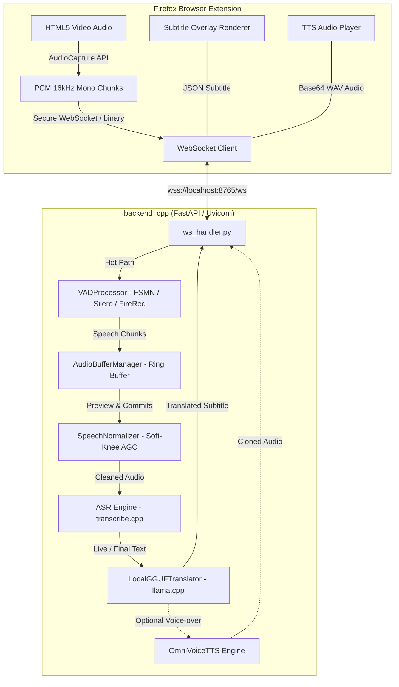

# Vibe Translation Addon — Real-Time Video Subtitle & Voice Cloning

[](https://www.python.org/)
[](https://fastapi.tiangolo.com/)
[](https://addons.mozilla.org/)
[](https://developer.nvidia.com/)
[](LICENSE)

A high-performance, fully offline, sub-second latency system for **real-time audio capture, speech recognition (ASR), translation, and voice cloning (TTS)** directly in your browser.

Designed for desktop PCs with NVIDIA GPUs (tested on Ryzen 5600X + RTX 5060 Ti / 40-series / 30-series), it delivers live bilingual subtitles and voice-over over any video streaming platform (YouTube, Bilibili, Coursera, etc.) with zero cloud API dependencies and complete privacy.

---

## 🚀 Key Highlights

- **⚡ Sub-Second End-to-End Latency**: From the moment a speaker stops talking to the translated subtitle appearing on screen in **~780 ms**.
- **🔒 100% Offline & Private**: All speech recognition, neural translation, and voice synthesis run strictly on your local machine.
- **🎙️ High-Speed Stream VAD**: Official **FSMN-VAD** (default: ~58 ms CPU per audio-second), **FireRed-VAD**, and **Silero-VAD** with dynamic threshold tuning and zero audio drop.
- **🔊 Intelligent Speech Normalizer**: Soft-knee AGC (Automatic Gain Control) with Background Music (BGM) resistance, plosive dampening, and zero hard-cliff pumping.
- **🤖 GPU-Accelerated ASR (`transcribe.cpp`)**: Ultra-fast transcription using **Qwen3-ASR 1.7B GGUF** via Vulkan/CUDA (~134 ms inference), delivering live streaming preview tokens.
- **🌐 Offline LLM Translation**: Fast neural machine translation powered by **Hunyuan-MT2 7B GGUF** (~64 tokens/sec) or lightweight models via `llama-cpp-python`.
- **🗣️ Synchronized Voice Cloning (TTS)**: PyTorch OmniVoice Vietnamese TTS engine for cloned speech voice-overs synthesized in ~500 ms.
- **🧩 Firefox Extension (Manifest V3)**: Seamless Web Audio API capture, low-overhead binary WebSocket streaming, and customizable subtitle overlay UI.

---

## 🏛️ System Architecture



---

## ⏱️ Latency Breakdown (Real Speech Benchmark)

| Stage | Engine / Model | Average Latency | Notes |
|---|---|---|---|
| **VAD Silence Wait** | FSMN-VAD | **~150 ms** | Configurable trailing silence limit |
| **VAD + Normalization** | AGC Soft-Knee | **~2 ms** | Pre-allocated float32 hot-loop buffer |
| **ASR Speech-to-Text** | Qwen3-ASR 1.7B (Vulkan/CUDA) | **~134 ms** | Live preview streams tokens every 350 ms |
| **Machine Translation** | Hunyuan-MT2 7B GGUF | **~478 ms** | ~64.2 tokens/second via `llama-cpp-python` |
| **Browser Dispatch** | WebSocket JSON | **~2 ms** | Instant subtitle display |
| **Total Subtitle Latency** | **Full Pipeline** | **~780 ms** | **Sub-second real-time responsiveness** |
| *Voice-Over (TTS)* | *PyTorch OmniVoice* | *~495 ms* | *Runs asynchronously in parallel to subtitle* |

---

## 📁 Repository Structure

```
├── backend_cpp/                 # Main Python + native C++ backend service
│   ├── asr/                     # Audio buffer & speech normalization pipeline
│   │   ├── audio_buffer.py      # Zero-copy audio snapshot ring buffer
│   │   └── speech_normalizer.py # AGC, soft-knee smootherstep & BGM resistance
│   ├── translation/             # Offline GGUF neural translation
│   │   ├── local_translator.py  # llama-cpp-python inference engine
│   │   └── prompt_strategies.py # Few-shot & structured translation prompts
│   ├── tts/                     # Real-time voice cloning engine
│   │   ├── audio_processor.py   # Resampling, time-stretch & WAV encoding
│   │   ├── omnivoice_engine.py  # PyTorch OmniVoice Vietnamese TTS singleton
│   │   └── voice_manager.py     # Reference voice cloning profiles
│   ├── vad/                     # Streaming Voice Activity Detection
│   │   ├── engines.py           # FSMN-VAD, Silero-VAD, FireRed-VAD engines
│   │   └── vad_processor.py     # Deterministic sample clock & state machine
│   ├── ws/                      # WebSocket protocol & connection management
│   │   ├── frame_protocol.py    # Binary frame header serialization
│   │   └── ws_handler.py        # Pipeline coordinator & async workers
│   ├── config.py                # Centralized configuration (VAD, ASR, TTS, WS)
│   ├── main.py                  # Server entrypoint (Uvicorn / FastAPI)
│   ├── requirements.txt         # Minimal Python dependencies
│   └── run_perf_test.py         # Automated performance & latency benchmark tool
├── extension_firefox/           # Firefox Add-on (Manifest V3)
│   ├── background/              # Background service worker & tab router
│   ├── content/                 # Content script & video overlay manager
│   ├── lib/                     # Audio capture, frame builder, ws client, tts
│   ├── popup/                   # Extension popup UI (VAD sensitivity, models)
│   └── manifest.json            # Extension manifest
├── report/                      # Architecture audits, benchmarks & plans
└── wav_test/                    # Multi-language test audio files
```

---

## 🛠️ Getting Started

### 1. Prerequisites

- **Operating System**: Windows 10/11 or Linux
- **Python**: 3.10, 3.11, 3.12, or 3.13
- **GPU**: NVIDIA GPU with CUDA or Vulkan support (Recommended: 8 GB+ VRAM)
- **Browser**: Mozilla Firefox

### 2. Installation

Clone the repository and install the backend dependencies:

```powershell
# Clone the repository
git clone https://github.com/khachuy279/vibe-translation-addon-transcribe_cpp.git
cd vibe-translation-addon-transcribe_cpp

# Create a virtual environment (optional but recommended)
python -m venv .venv
.venv\Scripts\activate

# Install dependencies
pip install -r backend_cpp/requirements.txt
```

### 3. Model Setup

Models are placed in `backend_cpp/models/` (excluded from git due to file size):
- **ASR Model**: `transcribe.cpp` format (e.g., `qwen3-asr-1.7b-f16.bin` or Vulkan GGUF)
- **Translation Model**: GGUF format (e.g., `tencent-hunyuan-mt-7b.q4_k_m.gguf`)
- **VAD Models**: Auto-downloaded or local snapshots in `backend_cpp/models/fsmn_vad`

### 4. Running the Backend Server

Start the local WebSocket service:

```powershell
python backend_cpp/main.py
```
The server will initialize models and listen at `wss://localhost:8765/ws`.

### 5. Installing the Firefox Extension

1. Open Firefox and navigate to `about:debugging#/runtime/this-firefox`.
2. Click **"Load Temporary Add-on..."**.
3. Select `extension_firefox/manifest.json`.
4. Open any video tab (e.g. YouTube). Click the **Bilingual Subtitle** icon to connect and start real-time subtitles.

---

## 🧪 Testing & Verification

Run the full verification and unit test suite:

```powershell
# Check code syntax, types, and linter across all 88 Python + 10 JS files
python backend_cpp/scripts/verify_all.py

# Run unit tests
python -m pytest backend_cpp/tests -q

# Run automated end-to-end performance diagnostic
python backend_cpp/run_perf_test.py
```

---

## ⚙️ Key Configuration Options

All settings are configured via environment variables or directly in [`backend_cpp/config.py`](file:///d:/vibe-translation-addon-transcribe_cpp/backend_cpp/config.py):

| Setting | Default | Description |
|---|---|---|
| `vad.vad_engine` | `"fsmn-vad"` | VAD engine: `fsmn-vad` (~58 ms/s), `firered-vad` (~108 ms/s), `silero-vad` (~13 ms/s) |
| `vad.silence_duration_ms` | `150` | Trailing silence limit gating utterance commit (crucial latency knob) |
| `vad.threshold` | `0.4` | Speech probability onset threshold (0.0 to 1.0) |
| `asr.preview_min_growth_ratio` | `0.0` | Growth ratio gating preview inference (set `0.5` to cut ASR compute by ~49%) |
| `translation.model` | `"tencent"` | Active translation model profile from `translation_models.yaml` |
| `tts.enabled` | `False` | Real-time Vietnamese voice cloning voice-over |

---

## 📄 License

This project is licensed under the [MIT License](LICENSE).
