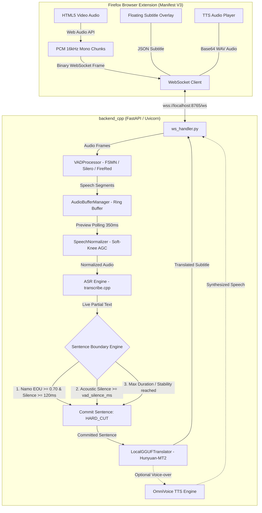

# Vibe Translation Addon — Real-Time Video Subtitle & Neural Translation

[](https://www.python.org/)
[](https://fastapi.tiangolo.com/)
[](https://addons.mozilla.org/)
[](https://developer.nvidia.com/)
[](LICENSE)

A high-performance, fully offline, sub-second latency system for **real-time audio capture, streaming speech recognition (ASR), semantic sentence boundary detection, neural translation, and voice synthesis (TTS)** directly in your browser.

Designed for desktop PCs with NVIDIA GPUs (tested on RTX 5060 Ti / 40-series / 30-series), it delivers live bilingual subtitles and voice-over over any video streaming platform (YouTube, Bilibili, Coursera, Twitter, Twitch, etc.) with **zero cloud API dependencies, zero data leakage, and complete privacy**.

---

## 🚀 Key Highlights

- **⚡ Sub-Second End-to-End Latency**: From the moment speech finishes to the translated subtitle appearing on screen in **~780 ms**.
- **🧠 Namo Turn Detector v1 (Semantic EOU)**: State-of-the-art multilingual mmBERT turn detector (`backend_cpp/models/namo`) prioritizing semantic completeness (#1 Priority) over acoustic silence. Sentences commit **~380–580 ms earlier** than standard VAD-only timeout.
- **🎙️ Mandatory Intelligent Stream VAD**: Official **FSMN-VAD** (default: ~58 ms CPU per audio-second, threshold 0.45, 500 ms silence, 300 ms hangover), **FireRed-VAD**, and **Silero-VAD** with dynamic threshold tuning and zero dropped frames.
- **🔊 Intelligent Speech Normalizer**: Soft-knee AGC (Automatic Gain Control) with Background Music (BGM) resistance, plosive dampening, and clean pre-roll boundary management.
- **🤖 Multi-Model GPU ASR (`transcribe.cpp`)**:
  - **Qwen3-ASR (1.7B & 0.6B GGUF)**: Audio-LLM delivering top accuracy (CER ~10.02% Strict).
  - **SenseVoiceSmall (Non-autoregressive)**: Ultra-fast (~20 ms inference) with continuous, fine-grained token emission, achieving a **22.5% early Namo EOU commit rate**.
  - **Nemotron 3.5 Streaming (0.6B)**: Native C++ streaming inference via `session.stream(...)` with 240 ms lookahead (`att_context_right: 3`).
- **🌐 Offline LLM Translation**: Fast neural machine translation powered by **Hunyuan-MT2 7B / 1.8B GGUF** via `llama-cpp-python` with a rolling context window (3 dialogue turns) for grammatical flow and pronoun consistency.
- **🛡️ Robust Concurrency & Clean Architecture**:
  - `CoalescingTokenQueue`: Event-loop-safe queue with latest-wins preview coalescing and lossless final commits without CPython internal mutations.
  - Non-blocking ONNX Namo inference (`asyncio.to_thread`).
  - Strict generation & epoch barriers preventing stale subtitle desyncs during video seeks.
- **🗣️ Synchronized Voice Cloning (TTS)**: PyTorch OmniVoice Vietnamese TTS engine for cloned speech voice-overs synthesized in parallel (~500 ms).
- **🧩 Firefox Extension (Manifest V3)**: Low-overhead binary WebSocket streaming via Web Audio API, responsive popup controls, and customizable floating subtitle overlay.

---

## 🏛️ System Architecture



---

## 🎯 Sentence Boundary Decision Engine

The pipeline uses a strict 3-tier hybrid commit hierarchy:

1. **Priority #1 — Namo Turn Detector (Semantic EOU):**
   - Model: `videosdk-live/Namo-Turn-Detector-v1-Multilingual` (`backend_cpp/models/namo/model_quant.onnx`).
   - When partial preview text reaches `min_tokens` (default: 3) and Namo predicts $P(\text{EOU}) \ge 0.70$ with trailing acoustic silence $\ge 120\text{ ms}$, the sentence commits immediately (`NAMO_EOU`).
   - Subtitles and translations appear on screen **380–580 ms sooner** than waiting for acoustic silence timeouts.
2. **Priority #2 — VAD Silence Timeout (`silence_duration_ms`):**
   - Acoustic fallback (default: 500 ms) when speech pauses mid-sentence or without clear linguistic closing markers.
3. **Priority #3 — Safety Limits (`max_duration_sec` & `split_on_stability`):**
   - Prevents buffer runaway on continuous background speech without natural pauses.

---

## 📊 ASR Model Matrix & Performance Comparison

Evaluated on real conversational speech (332.03s audio stream, 45 golden dialogue turns):

| Model | Architecture Type | Inference Method | Latency | CER (Strict) | Namo EOU Ratio | Best Use Case |
|---|---|:---:|:---:|:---:|:---:|---|
| **SenseVoiceSmall** | Non-autoregressive | `session.run()` | **~20 ms** | 12.71% | 🏆 **22.5% (20 commits)** | **Fastest real-time response, smoothest subtitle pacing** |
| **Qwen3-ASR 1.7B** | Audio-LLM GGUF | `session.run()` | ~134 ms | **10.02%** | 19.3% (17 commits) | **Highest accuracy & complex terminology** |
| **Qwen3-ASR 0.6B** | Audio-LLM GGUF | `session.run()` | ~75 ms | 14.80% | 15.2% | Low VRAM (~650 MB) budget |
| **Nemotron 3.5 Streaming** | FastConformer RNNT | `session.stream()` | Streaming | 26.04% | 3.1% | Native continuous streaming |

---

## 📁 Repository Structure

```
├── backend_cpp/                 # Main Python + native C++ backend service
│   ├── asr/                     # Audio buffer, ASR engine & boundary detectors
│   │   ├── audio_buffer.py      # Audio ring buffer with trailing silence calculation
│   │   ├── namo_detector.py     # Namo Turn Detector v1 (ONNX Runtime, mmBERT)
│   │   ├── sentence_segmenter.py# CJK & Latin prefix stripping, stability detector
│   │   ├── speech_normalizer.py # AGC, smootherstep curve & BGM resistance
│   │   └── transcribe_engine.py # Streaming ASR coordinator & CoalescingTokenQueue
│   ├── models/                  # Local model weights directory (git-ignored)
│   │   ├── namo/                # Namo Turn Detector weights & tokenizer
│   │   └── fsmn_vad/            # FSMN-VAD model snapshot
│   ├── translation/             # Offline GGUF neural translation
│   │   ├── local_translator.py  # llama-cpp-python engine with lazy locks
│   │   ├── model_registry.py    # Catalog loader for translation models
│   │   └── prompt_strategies.py # Context-aware few-shot prompts
│   ├── tts/                     # Real-time voice cloning engine
│   │   ├── audio_processor.py   # Audio resampling & WAV packaging
│   │   └── omnivoice_engine.py  # PyTorch OmniVoice Vietnamese TTS singleton
│   ├── vad/                     # Streaming Voice Activity Detection
│   │   ├── engines.py           # Safe, optional-import engines (FSMN, Silero, FireRed)
│   │   └── vad_processor.py     # Deterministic sample clock & state machine
│   ├── ws/                      # WebSocket protocol & connection management
│   │   ├── frame_protocol.py    # Binary audio frame header serialization
│   │   ├── session_state.py     # Session state & epoch barrier coordinator
│   │   └── ws_handler.py        # Pipeline coordinator & async workers
│   ├── config.py                # Centralized configuration (pure Python defaults)
│   ├── main.py                  # Server entrypoint (Uvicorn / FastAPI)
│   ├── models.yaml              # ASR model catalog & parameters
│   ├── translation_models.yaml  # Translation model catalog (Hunyuan-MT2)
│   └── requirements.txt         # Core dependencies
├── benchmarks/                  # Multi-model sweep & benchmark suites
│   ├── namo_benchmark.py        # Namo Turn Detector multi-model comparison
│   └── sentence_config_sweep.py # VAD & boundary parameter sweeps
├── extension_firefox/           # Firefox Add-on (Manifest V3)
│   ├── background/              # Background service worker
│   ├── content/                 # Content script & floating subtitle renderer
│   ├── popup/                   # Extension popup UI (VAD sensitivity, model selection)
│   └── manifest.json            # Extension manifest
└── report/                      # Comprehensive benchmark & architecture reports
```

---

## 🛠️ Getting Started

### 1. Prerequisites

- **Operating System**: Windows 10/11 or Linux
- **Python**: 3.10, 3.11, 3.12, or 3.13
- **GPU**: NVIDIA GPU with Vulkan or CUDA support (Recommended: 6 GB+ VRAM)
- **Browser**: Mozilla Firefox

### 2. Installation

```powershell
# Clone the repository
git clone https://github.com/khachuy279/vibe-translation-addon-transcribe_cpp.git
cd vibe-translation-addon-transcribe_cpp

# Create and activate virtual environment
python -m venv .venv
.venv\Scripts\activate

# Install core backend dependencies
pip install -r backend_cpp/requirements.txt
```

### 3. Model Weights Setup

Place weights in `backend_cpp/models/`:
- **Namo Turn Detector**: Files (`model_quant.onnx`, `config.json`, `tokenizer.json`, etc.) in `backend_cpp/models/namo/` (auto-downloaded from Hugging Face if missing).
- **ASR Models**: GGUF files in `backend_cpp/models/` (e.g., `Qwen3-ASR-1.7B-Q8_0.gguf`, `SenseVoiceSmall-F32.gguf`).
- **Translation Models**: GGUF files in `backend_cpp/models/` (e.g., `Hy-MT2-7B-UD-Q4_K_XL.gguf`, `Hy-MT2-1.8B-UD-Q8_K_XL.gguf`).
- **VAD Models**: Automatically downloaded to `backend_cpp/models/fsmn_vad/`.

### 4. Running the Backend Server

Start the local WebSocket service:

```powershell
python -m uvicorn backend_cpp.main:app --host 127.0.0.1 --port 8765
```

The server pre-warms ASR, VAD, and Translation models and listens at `wss://localhost:8765/ws`.

### 5. Installing the Firefox Extension

1. Open Firefox and navigate to `about:debugging#/runtime/this-firefox`.
2. Click **"Load Temporary Add-on..."**.
3. Select `extension_firefox/manifest.json`.
4. Open any video tab (e.g. YouTube). Click the **Vibe Translation** extension icon to connect and start real-time subtitles.

---

## 🧪 Testing & Verification

Run the full automated test suite (**219 functional tests passing**):

```powershell
# Run full test suite
python -m pytest backend_cpp/tests/ -v

# Run Namo Turn Detector multi-model benchmark
python benchmarks/namo_benchmark.py
```

---

## ⚙️ Key Configuration Options

Configured directly in [`backend_cpp/config.py`](file:///d:/vibe-translation-addon-transcribe_cpp/backend_cpp/config.py):

| Setting | Default | Description |
|---|---|---|
| `vad.vad_engine` | `"fsmn-vad"` | VAD engine: `fsmn-vad`, `firered-vad`, `silero-vad` |
| `vad.threshold` | `0.45` | Unified speech onset probability threshold |
| `vad.silence_duration_ms` | `500` | Acoustic silence required for VAD commit |
| `vad.hangover_ms` | `300` | Trailing speech hangover to preserve soft word codas |
| `namo.enabled` | `True` | Enable Namo Turn Detector semantic boundary commits |
| `namo.confidence_threshold`| `0.70` | Confidence threshold for Namo EOU ($0.70$ default, $0.75$ strict) |
| `namo.require_silence_ms` | `120` | Trailing silence required before Namo early commit |
| `asr.active_model` | `"qwen3-asr-1.7b"` | Active ASR model (`qwen3-asr-1.7b`, `sensevoice-small`, etc.) |
| `translation.base` | `"tencent"` | Active translation model profile (`tencent` 7B or `tencent-1.8b`) |
| `translation.use_context` | `True` | Enable rolling context window for discourse coherence |

---

## 📄 License

This project is licensed under the [MIT License](LICENSE).
