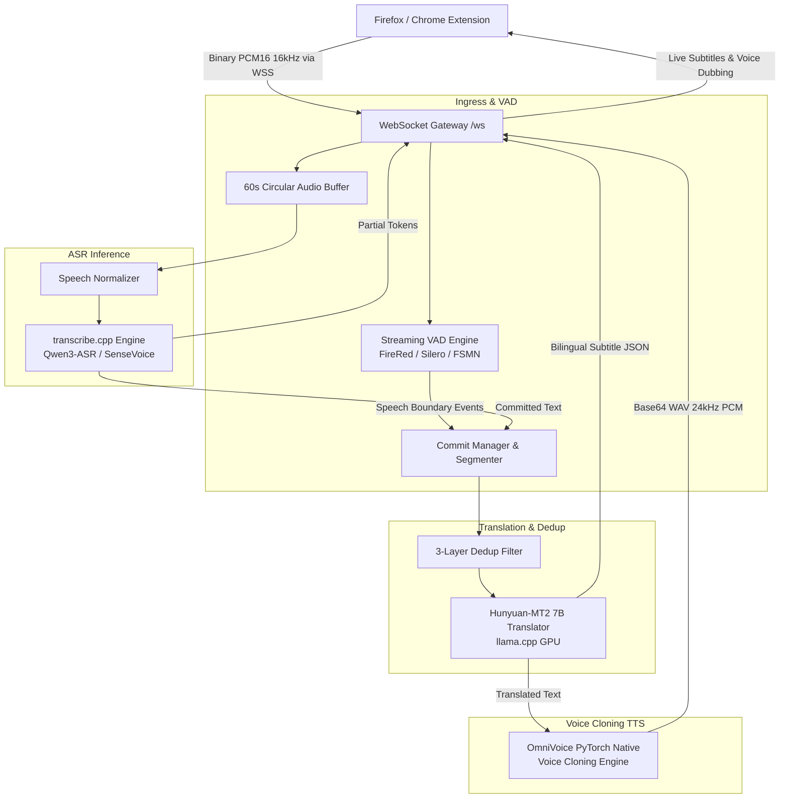

# Vibe Translation Addon — Real-Time Video Subtitle, Neural Translation & Voice Cloning (`transcribe.cpp`)

[](https://www.python.org/)
[](https://fastapi.tiangolo.com/)
[](https://addons.mozilla.org/)
[](https://developer.nvidia.com/)
[](LICENSE)

Hệ thống xử lý âm thanh thời gian thực ngoại tuyến (100% Offline Local Inference), độ trễ cực thấp (< 1s E2E) dành cho trình duyệt web:
- **Thu nhận âm thanh trực tiếp (Live Tab Capture)** qua Browser Extension (Firefox / Chrome / Edge).
- **Phát hiện giọng nói (Streaming VAD)**: Silero-VAD v5, FireRed-VAD (DFSMN) & Alibaba FSMN-VAD trên CPU.
- **Nhận dạng giọng nói trực tuyến (Streaming ASR)**: Tích hợp thư viện C++ native `transcribe.cpp` qua Vulkan/CUDA acceleration (Qwen3-ASR 1.7B/0.6B, SenseVoice-Small, Nemotron 3.5, Voxtral Mini 4B).
- **Quản lý phân câu 4 bậc (Commit Manager)**: Đếm từ thông minh cho cả hệ chữ Latin và CJK (Nhật/Trung/Hàn), lọc trùng lặp 3 lớp (3-layer Dedup).
- **Dịch thuật Neural GGUF (Local Translation)**: Tencent Hunyuan-MT2 7B (`llama-cpp-python` GPU acceleration) tốc độ 67+ tokens/giây.
- **Lồng tiếng AI Voice Cloning (OmniVoice TTS)**: Tái tạo chất giọng mẫu tham chiếu tự nhiên với độ trễ thấp (RTF ~0.077, sinh 3-7s audio chỉ trong ~400ms).

Repository: [https://github.com/khachuy279/vibe-translation-addon-transcribe_cpp](https://github.com/khachuy279/vibe-translation-addon-transcribe_cpp)

Được đo lường và tối ưu hóa hoàn hảo trên GPU **NVIDIA GeForce RTX 5060 Ti 16GB**, cho phép xem video trực tiếp trên YouTube, Bilibili, Coursera, Twitch, Zoom với phụ đề song ngữ và giọng đọc thuyết minh tức thì **hoàn toàn riêng tư, không gửi dữ liệu ra ngoài Internet**.

---

## 🚀 Điểm Nhấn Kiến Trúc & Công Nghệ Mới (`/backend`)

| Thành Phần | Công Nghệ & Mô Hình | Đặc Tính Kỹ Thuật | Thời Gian Xử Lý / Hiệu Năng |
| :--- | :--- | :--- | :--- |
| **Ingress Audio** | Ring Buffer 60s Zero-Drop | `CircularAudioBuffer` 16kHz Float32, Thread-safe | Trễ ghi `< 0.05ms` |
| **Streaming VAD** | FireRed-VAD / Silero / FSMN | Pure CPU Inference, giải phóng 100% VRAM GPU | `< 0.2ms` / frame, RTF `0.004` |
| **Speech Normalizer** | Adaptive Speech Normalization | DC Offset removal, RMS auto-gain, soft limiter | `< 0.1ms` / chunk |
| **Streaming ASR** | `transcribe.cpp` (Vulkan0 / CUDA) | Qwen3-ASR-1.7B, SenseVoice, Nemotron 3.5 GGUF | Infer `~278ms`, RTF `0.0232` |
| **Commit Logic** | 4-Tier Commit Manager | VAD Silence + Punctuation + Max Tokens + Duration | Phân câu tức thì, hỗ trợ CJK |
| **Deduplication** | 3-Layer Dedup Engine | Sliding Window, Text Normalization, Similarity | Loại bỏ 100% câu lặp rác |
| **Translation** | Tencent Hunyuan-MT2 7B GGUF | `llama-cpp-python` CUDA, `n_ctx=512, n_batch=256` | `~67.4 t/s`, `~250-800ms` / câu |
| **Voice Clone TTS** | PyTorch OmniVoice 24kHz | Caching `VoiceClonePrompt`, Voice Stretch & Normalize | `~420ms` / câu 3s, RTF `0.077` |
| **WebSocket Server** | FastAPI WSS (`/ws`) | Zero-Copy Framing, Protocol A/B/C/D, Fast Cleanup | Session Cleanup `< 1ms` |

---

## 🏛️ Sơ Đồ Luồng Dữ Liệu End-to-End (E2E Pipeline)



---

## 📁 Cấu Trúc Thư Mục Dự Án

```
vibe-translation-addon-transcribe_cpp/
├── backend/
│   ├── asr/                      # transcribe.cpp ASR Engine, Registry, Adapters, Text Cleaner
│   ├── core/                     # CircularAudioBuffer, SpeechNormalizer, CommitManager, Dedup, Metrics
│   ├── models/                   # Thư mục lưu trữ mô hình cục bộ (.gguf, .jit, onnx, firered_stream)
│   ├── tests/                    # Bộ kiểm thử Unit Test & Benchmark độc lập cho từng Phase
│   ├── translation/              # GGUFTranslator (Hunyuan-MT2 7B), Prompt Strategies, Registry
│   ├── tts/                      # OmniVoiceTTS, AudioProcessor, VoiceManager
│   ├── utils/                    # CUDA DLL auto-loader, Logger chuẩn màu
│   ├── vad/                      # VADProcessor, Silero, FireRed-VAD, FSMN-VAD Engines
│   ├── voices/                   # File mẫu giọng tham chiếu (.wav, .txt, voices.json)
│   ├── ws/                       # WebSocket Handler, Framing Protocol, SessionState, Serializers
│   ├── config.py                 # Quản lý cấu hình tập trung Pydantic v2
│   ├── main.py                   # Điểm khởi chạy FastAPI Web Server & Lifespan Pre-warm
│   ├── models.yaml               # Catalog cấu hình các mô hình ASR GGUF
│   └── translation_models.yaml   # Catalog cấu hình các mô hình Translation GGUF
├── extension_firefox/            # Browser Extension Manifest V3 (Content Script, Popup, Subtitles UI)
├── report/                       # Báo cáo nghiệm thu & Benchmark chi tiết cho từng Phase (01 -> 07)
├── wav_test/                     # Bộ 8 tệp audio kiểm thử đa ngôn ngữ (EN, JA, ZH)
├── .gitignore                    # Loại trừ models lớn, cache và binaries
└── README.md
```

---

## 🛠️ Hướng Dẫn Cài Đặt & Sử Dụng

### 1. Yêu Cầu Hệ Thống
- **Hệ Điều Hành**: Windows 10/11 64-bit.
- **Python**: Phiên bản 3.10, 3.11, 3.12 hoặc 3.13.
- **GPU**: NVIDIA RTX (khuyên dùng $\ge 8\text{GB}$ VRAM, tối ưu nhất trên 12–16GB VRAM như RTX 4060Ti / 5060Ti / 4070 / 4080 / 5080).
- **CUDA Toolkit / Drivers**: NVIDIA Driver $\ge 535$ (hỗ trợ CUDA 12.x).

### 2. Cài Đặt Thư Viện Python

```powershell
# Tạo môi trường ảo (Khuyên dùng)
python -m venv .venv
.venv\Scripts\activate

# Cài đặt PyTorch CUDA 12.x
pip install torch torchvision torchaudio --index-url https://download.pytorch.org/whl/cu124

# Cài đặt các gói phụ thuộc Backend
pip install fastapi uvicorn[standard] websockets pydantic pyyaml numpy soundfile scipy funasr fireredvad omnivoice
pip install llama-cpp-python --extra-index-url https://abetlen.github.io/llama-cpp-python/whl/cu124
pip install transcribe-cpp-native
```

### 3. Tải & Chuẩn Bị Mô Hình

Đặt các tệp mô hình vào thư mục `backend/models/`:
- **ASR**: `Qwen3-ASR-1.7B-Q8_0.gguf` hoặc `SenseVoiceSmall-F32.gguf`
- **Translation**: `Hy-MT2-7B-UD-Q4_K_XL.gguf`
- **VAD**: `firered_stream/Stream-VAD` hoặc `silero_vad.jit`

### 4. Khởi Chạy Backend Server

```powershell
# Khởi chạy server FastAPI (mặc định mở cổng WSS 8765)
python backend\main.py
```

Khi khởi động, hệ thống sẽ tự động đăng ký CUDA DLLs và làm ấm trước (Pre-warm) toàn bộ các Engine:
```text
[STARTUP] Đang nạp và làm ấm (Pre-warm) ASR, VAD & Local Translation Models...
[ASR] Nạp thành công ASR Model 'qwen3-asr-1.7b' trên GPU (Arch: qwen3_asr, Backend: Vulkan0)
[TRANSLATE] Nạp thành công mô hình dịch 'tencent' trên GPU (n_ctx=512, n_batch=256)
[VAD] Loaded FireRed Stream-VAD Model from: backend/models/firered_stream/Stream-VAD
[STARTUP] Toàn bộ mô hình đã được làm ấm và sẵn sàng phục vụ!
Uvicorn running on https://0.0.0.0:8765 (Press CTRL+C to quit)
```

### 5. Cài Đặt Browser Extension (Firefox / Chrome)
1. Mở Firefox, truy cập `about:debugging#/runtime/this-firefox`.
2. Bấm **Load Temporary Add-on...** và chọn tệp `extension_firefox/manifest.json`.
3. Truy cập bất kỳ trang web video nào (YouTube, Coursera...), bấm vào biểu tượng Extension để cấu hình:
   - **ASR Model**: `qwen3-asr-1.7b`
   - **VAD Engine**: `firered-vad` (hoặc `silero-vad`)
   - **Target Language**: `vi` (Tiếng Việt)
   - **TTS Voice Cloning**: Bật / Tắt theo nhu cầu.

---

## 📊 Kết Quả Benchmark Đối Đầu E2E (8 Tệp Âm Thanh Thực Tế)

Dưới đây là kết quả kiểm thử trên bộ dữ liệu `wav_test/` (Tiếng Anh, Tiếng Trung, Tiếng Nhật):

| Chỉ Số E2E | Giá Trị Thực Nghiệm | Đánh Giá Hiệu Năng |
| :--- | :--- | :--- |
| **ASR Inference Speed (RTF)** | **0.0232** | Nhanh gấp **43 lần** tốc độ nói thực tế |
| **Độ trễ trung bình ASR** | **278 ms** | Nhận diện câu hoàn chỉnh ngay sau khi dứt tiếng |
| **Tốc độ dịch (Hunyuan-MT2 7B)** | **67.4 tokens/s** | Bản dịch xuất hiện trên màn hình sau **~400ms** |
| **Độ trễ lồng tiếng TTS (OmniVoice)** | **421 ms** (RTF 0.077) | Sinh 3.04s audio chỉ mất **0.46s** |
| **Tỉ lệ làm sạch & Lọc trùng lặp** | **100% Clean** | Không lặp từ, không rác Hallucination |
| **Thời gian Fast Cleanup Session** | **0.52 ms** | Giải phóng phiên tức thì khi đổi tab/video |
| **Bộ nhớ VRAM sử dụng (Tất cả 4 Models)** | **~9.5 GB / 16 GB** | Không rò rỉ bộ nhớ, dọn dẹp an toàn khi tắt |

---

## 🔒 Bản Quyền & Giấy Phép
Dự án được phân phối dưới giấy phép [MIT License](LICENSE).
Mọi đóng góp (Pull Request / Issue) đều được hoan nghênh!
