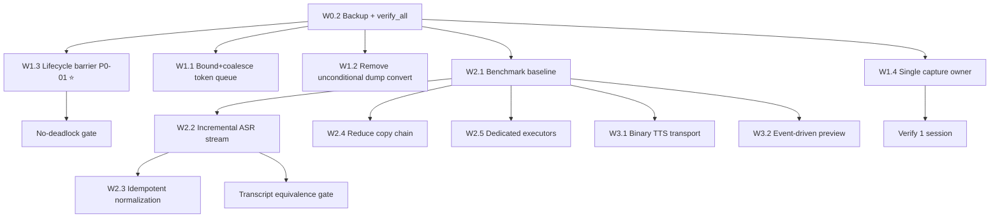

# Implementation Plan — `backend_cpp` + `extension_firefox`

**Nguồn:** `report/backend_cpp_extension_performance_audit.md`
**Loại tài liệu:** Verification + Implementation Plan
**Ngày:** 2026-09-10
**Trạng thái công việc:** xem `report/TODO.md` (danh sách gọn, đánh dấu đã xong / chưa làm)
**Rev:** 17 — W2.5 bị bác bỏ bằng đo (dispatch 0.06 ms); TTS đo lần đầu: 499 ms/câu, +1.65 GB RSS (xem §0.9)
**Trạng thái xác minh:** Đã kiểm tra trực tiếp source code (không chỉ đọc report)

---

## 0.1 TRẠNG THÁI TRIỂN KHAI (Rev 17)

| Work item | Trạng thái | Ghi chú |
|---|---|---|
| W0.2 Backup + verify harness | ✅ DONE | `scratch/backup_before_perf_plan/` + `backend_cpp/scripts/verify_all.py` |
| **W1.3 Lifecycle barrier (P0-01)** | ✅ **DONE** | `_close_shared_locked()`, `acquire_infer_lock()/release_infer_lock()`, `unload_shared_model() -> bool` có timeout, `ensure_model()` barrier, guard `ensure_session()`. 12 test mới |
| W1.2 Bỏ dump conversion vô điều kiện (N-01) | ✅ DONE | `dump_vad_utterance_f32()` + `float32_to_pcm16_bytes()`, conversion chuyển sang worker thread. 3 test mới |
| W1.1 Bound + coalesce token queue (P0-02) | ✅ DONE | `maxsize=config.asr.token_queue_maxsize`; final lossless, preview latest-wins. 9 test mới |
| W1.4 Single capture owner (P1-04) | ✅ DONE (+ hotfix) | discover→pick→start 1 frame; guard ở content script; admission control backend (`config.ws.max_sessions`). **Hotfix Rev 4:** bản đầu làm hỏng iframe cross-origin — xem dưới |
| W4.1 Logging profile (P2-10) | ✅ DONE | `INFO` mặc định, `BS_LOG_LEVEL=DEBUG` để opt-in |
| W2.x Performance | ✅ **W2.1 XONG** (baseline) · ✅ **W2.2 XONG** (gate, mặc định tắt — chờ quyết định) | §0.2, §0.5 |
| Bước 1 — điều tra VAD (stage CPU #1) | ✅ DONE | §0.3 |
| Bước 2 — transcript trùng + cảnh báo RSS | ✅ DONE — cả hai là artifact đo, **không** phải bug sản phẩm | §0.4 |
| Bước 3 — W2.2 (spike + growth gate) | ✅ DONE — spike phủ định kế hoạch cũ, lever mới −49 % infer ASR (gate **mặc định TẮT** theo quyết định của bạn) | §0.5 |
| Bước 4 — đổi VAD default → `fsmn-vad` | ✅ DONE — −47 % CPU stage VAD, transcript GIỐNG HỆT; fallback hết âm thầm | §0.6 |
| Bước 5 — audit load/chạy model dịch | ✅ DONE — GPU đúng (33/33 layer), prefill 9 %, decode 91 %; sửa bug DLL registration; 4 model đã đo | §0.7 |
| Bước 6 — chọn model dịch | ✅ **CHỐT: giữ `tencent` 7B** — ưu tiên chất lượng dịch (quyết định 2026-09-11) | §0.7D |
| Bước 7 — ngân sách độ trễ thật | ✅ DONE — phát hiện **480 ms im lặng VAD** (44 %) bị bỏ sót; đã đính chính `hangover_ms` | §0.8 |
| Bước 8 — chọn `silence_duration_ms` | ✅ DONE — **150 ms**, −292 ms độ trễ, transcript GIỐNG HỆT, 4 test + 2 mutation | §0.8E |
| Bước 9 — W2.5 (P1-08) | ❌ **BÁC BỎ BẰNG ĐO** — dispatch delay 0.06 ms, max concurrent 2/16 worker | §0.9A |
| Bước 10 — đo TTS | ✅ DONE — 499 ms/câu, RTF 0.206, +1.65 GB RSS, load 4.17 s; không ảnh hưởng đường phụ đề | §0.9B |
| W3.x Transport/scale | ⏸️ CHƯA — chỉ khi benchmark chứng minh | |

---

## 0.2 W2.1 — BASELINE ĐÃ ĐO ĐƯỢC (gate cho Phase 2)

**Deliverables**

| File | Vai trò |
|---|---|
| `report/baseline_perf.json` | baseline có cấu trúc (environment + micro + e2e) |
| `backend_cpp/tests/perf_baseline.py` | micro-benchmark A/C + scenario A/D/G |
| `backend_cpp/tests/perf_real_audio.py` | scenario R — audio thật, **đo được delivery** |
| `backend_cpp/tests/test_perf_baseline_gate.py` | 18 test bảo vệ chính harness đo |
| `backend_cpp/tests/test_perf_leak_detector.py` | 6 test bảo vệ detector leak khỏi dương tính giả |
| `scratch/show_baseline.py` | in baseline dạng người đọc |

**Cách chạy**

```powershell
python backend_cpp/run_perf_test.py --mode micro        # không cần server (giây)
python backend_cpp/run_perf_test.py --mode baseline     # đầy đủ (~3.5 phút, tự bật server)
python scratch/show_baseline.py                          # đọc kết quả
python scratch/verify_guards_catch_regressions.py        # chứng minh guard không vô nghĩa
```

### Kết quả đo (RTX 5060 Ti 16GB, qwen3-asr-1.7b Vulkan, fsmn-vad, translation tencent)

| # | Chỉ số | Giá trị đo | So với audit |
|---|---|---|---|
| 1 | **VAD (fsmn) — chi phí CPU** | **81 ms / audio-giây** (RTF 0.081) | audit ghi `UNKNOWN` |
| 2 | **VAD (firered)** | **154 ms / audio-giây** (RTF 0.154) | audit ghi `UNKNOWN` |
| 3 | ASR infer theo độ dài utterance | 76 ms @1s → 131 ms @6s (1.57× cho 6× độ dài) | P1-01 giả định tăng mạnh |
| 4 | ASR RTF | 0.080 @1s → 0.016 @6s (luôn ≪ 1) | "NEEDS BENCHMARK" |
| 5 | **Snapshot + normalize (toàn utterance)** | **0.94–1.26 ms** (≈ **1 %** của infer) | P1-01/P1-02 xem là bottleneck chính |
| 6 | Toàn bộ copy chain | **0.70 ms / audio-giây** | P1-03 xem là đáng kể |
| 7 | ASR lock wait p99 @ 1/2/4 session | **31 → 241 → 417 ms** | P1-05 xác nhận |
| 8 | **Translation infer** | **p50 447 ms, p90 651 ms / câu** | audit ghi `UNKNOWN` |
| 9 | Translation queue wait | p50 0.059 ms (không nghẽn) | P1-11 |
| 10 | Real audio 24 s | 7 utterance (14 final message — xem §0.4A), 23 preview, 7 translation, RSS +645 MB lần đầu | lần đầu đo được delivery |

### 🔄 Đảo thứ tự ưu tiên Phase 2 (kết luận quan trọng nhất của W2.1)

1. **VAD (81–154 ms/audio-giây) là stage CPU lớn nhất**, lớn hơn **~100×** toàn bộ công việc
   snapshot + normalize + copy chain cộng lại (~1.7 ms/audio-giây). Audit **không** xếp VAD vào
   top-10 chi phí compute (chỉ có P2-04 nói về phần NumPy nhỏ bên trong).
   → **Nguồn tối ưu CPU số 1 mới.** Lưu ý P2-04 (chuyển đổi NumPy mỗi frame) chỉ ~0.4–0.5 ms/audio-giây:
   **tối ưu nó gần như vô nghĩa**, phải nhắm vào engine/nhịp gọi.
2. **P1-01 / P1-02 / P1-03 bị hạ ưu tiên.** "Repeated whole-utterance work" là **đúng về mặt
   cấu trúc** (allocation tăng 7.9× khi độ dài tăng 8×) nhưng **giá trị tuyệt đối rất nhỏ**:
   ≤ 1.7 ms/audio-giây. Trần lợi ích của W2.2 vì thế bị chặn trên bởi con số này, **không** phải
   bởi "inference khổng lồ lặp lại" — infer chỉ 76–131 ms và RTF ≤ 0.08.
   → W2.2 vẫn nên làm (giảm RTF và tải GPU) nhưng **không phải vì CPU**.

   > ⚠️ **ĐÍNH CHÍNH (sau §0.5):** kết luận này **quá sớm và sai một phần**. Tôi đã đo
   > "repeated whole-utterance work" bằng **snapshot + normalize** (chỉ ~1 ms), nhưng phần lớn
   > của việc lặp lại toàn utterance là **chính bản thân ASR inference**: preview chạy lại
   > toàn bộ utterance mỗi 350 ms ⇒ **81 % inference là preview**, khuếch đại **2.27×**, tổng
   > **5,087 ms** infer. Đây lớn hơn ~120× con số 41 ms mà tôi dùng để hạ ưu tiên.
   > **P1-01 ("repeated whole-utterance work") hoá ra ĐÚNG và quan trọng.** Bài học: đừng suy
   > ra "trần lợi ích" của một finding từ một *stage con* của nó.
3. **Trên critical path phụ đề, translation mới là số hạng lớn**: 447–651 ms/câu so với ASR commit
   ~130 ms. Kết luận "ASR preview là bottleneck lớn nhất" của audit cần chỉnh lại.
4. **P1-05 xác nhận bằng số**: lock wait p99 31 → 417 ms khi lên 4 session (tuyến tính theo số session).
5. **P1-08 (executor dùng chung)** trở nên đáng quan tâm hơn: VAD 81–154 ms/audio-giây chạy trên
   cùng default executor với ASR/translation/TTS.

### Phát hiện mới trong lúc làm W2.1

- 🐞 **`perf_profiler.dump_report_file()` dùng `config` không import → `NameError`.** Lỗi tiềm ẩn
  từ trước, chỉ lộ ra khi `config.perf.enabled = True` (mặc định `False`). Đã sửa.
- 🐞 **`config.perf.enabled` mặc định `False` → mọi `record_metric` là no-op.** Benchmark đầu tiên
  báo "0 inference" trong khi server thật sự đã chạy. Benchmark giờ tự bật, và **cảnh báo** khi
  dùng server ngoài.
- ⚠️ **Audio tổng hợp không dùng được để đo delivery**: FireRed VAD phân loại nó là non-speech
  (0 frame) và ASR trả **text rỗng** → `_emit_final()` bỏ qua → client nhận 0 message. Đã thêm
  `_validity()` phân biệt rõ "VAD mismatch" và "empty transcript", và thêm scenario R dùng audio thật.
- ✅ **"Transcript bị lặp đôi" — ĐÃ GIẢI QUYẾT, KHÔNG phải bug sản phẩm.** Kết luận ban đầu ở đây
  ("có thể là lỗ hổng phối hợp stability-split với commit dedup") là **SAI**. Nguyên nhân là
  `_process_translation_item()` **cố tình** gửi thêm một `utterance_update` `is_final` kèm bản dịch
  để tương thích ngược, còn cách đếm trong harness thì đếm cả message. Chi tiết + bằng chứng: **§0.4A**.
- ✅ **`[RESOURCE_LEAK_WARNING]` +655 MB — dương tính giả, đã sửa.** Baseline RSS chụp trước khi
  model load lazy; đo 3 lần liên tiếp cho +644 / +6.4 / +4.8 MB ⇒ chi phí một lần, không leak. **§0.4B**.

### Giới hạn đã biết của baseline

- `scenario D` chỉ đo được **queue/RSS**, không đo delivery (dùng audio tổng hợp).
- `scenario G` tạm đặt `config.ws.max_sessions = 0`; với server ngoài phải tự đặt.
- Micro-benchmark VAD chỉ chạy 2 engine; `ja.wav`/`ko.wav` là định dạng float nên chưa dùng được.
- Số liệu thuộc **một máy** (RTX 5060 Ti, 12 CPU); đổi máy phải đo lại.

---

## 0.3 BƯỚC 1 — ĐIỀU TRA VAD (stage CPU lớn nhất, audit chưa từng đo)

**Công cụ:** `scratch/profile_vad.py` (cProfile từng engine) ·
`scratch/compare_vad_engines.py` → gọi `benchmark_vad_engine_tradeoff()` trong
`perf_baseline.py` (đã vào `report/baseline_perf.json`).

### Chi phí trên audio THẬT (24 s speech, `wav_test/OSR_us_000_0010_16k.wav`)

| engine | ms/audio-giây | RTF | × rẻ nhất | segments | speech ratio | Δ ratio |
|---|---|---|---|---|---|---|
| **silero-vad** | **13.5** | 0.0135 | ×1.00 | 9 | 0.671 | — |
| fsmn-vad | 55.0 | 0.0550 | ×4.07 | 8 | 0.771 | +0.100 |
| **firered-vad** (default) | **108.5** | 0.1085 | **×8.04** | 8 | 0.796 | +0.125 |

Segments của cả ba khớp nhau ở mức hợp lý (`[0.5–3.6]`, `[7.8–10.4]`, `[14.3–16.9]`, …).

### Chi phí nằm ở đâu (cProfile, 2 s audio)

| engine | số lời gọi hàm | Nóng nhất | Diễn giải |
|---|---|---|---|
| silero-vad | **3 871** | `module._call_impl` (0.068/0.071 s) | **compute thật**, rất ít overhead |
| fsmn-vad | **73 846** | `torch.linear` ×396, `torch.cat` ×360, `copy.deepcopy` ×6 567, `torchaudio get_mel_banks` ×33 | **nghẽn ở framework dispatch**, không phải model |
| firered-vad | 53 826 | **`torch.conv1d` ×640 = 0.094/0.231 s (41 %)** | **compute thật** của conv |

### Kết luận & khuyến nghị

1. **P2-04 (chuyển đổi NumPy mỗi frame) — ĐÓNG, không đáng tối ưu.** Phần "bookkeeping"
   (khoá, slice, `astype`, callback) đo được **≈ 0 ms** (thậm chí âm trong sai số). Toàn bộ
   chi phí nằm trong lời gọi engine.
2. **Đòn tối ưu thật là CHỌN ENGINE, không phải sửa code VAD.** Default hiện tại
   `firered-vad` là engine **đắt nhất (×8 silero)**. Chỉ đổi default sang `fsmn-vad` đã tiết
   kiệm ~53 ms/audio-giây; sang `silero-vad` tiết kiệm ~95 ms/audio-giây.
   **Nhưng** silero cắt biên nhiều hơn (ratio 0.671 so với 0.771/0.796 → ~12 % ít speech hơn)
   và có thêm 1 segment ngắn 0.3 s. **Cần kiểm tra chất lượng phụ đề trước khi đổi default** —
   không đổi chỉ vì rẻ hơn.
3. **fsmn còn ~25 % overhead có thể bỏ** (frontend trích feature + `deepcopy` mỗi frame). Có
   thể tối ưu (tái dùng mel banks, batch frame), nhưng vì silero đã rẻ hơn 4× nên **đổi engine
   rẻ hơn nhiều so với tối ưu fsmn**.
4. **P1-08 trở nên quan trọng hơn VAD-internal**: 13–108 ms/audio-giây chạy trên **cùng default
   executor** với ASR/translation/TTS. Tách executor có giá trị cấu trúc lớn hơn việc vi chỉnh
   bên trong VAD.
5. **Không đề xuất đẩy VAD lên GPU**: frame chỉ 512–960 mẫu, overhead launch + H2D sẽ chi phối
   (chưa đo — ghi rõ là giả thuyết, không phải kết luận).

### 🐞 Phát hiện mới: fallback âm thầm về engine đắt nhất

`VADEngineFactory.get_engine()` map **mọi tên engine không hợp lệ** về `firered-vad`. Nghĩa là
một lỗi gõ trong config **âm thầm** chuyển sang engine đắt nhất (×8 silero) thay vì báo lỗi.
Đã ghi lại bằng test `test_vad_engine_tradeoff_records_unknown_engine_names`.
**Khuyến nghị:** log WARNING khi fallback, hoặc từ chối tên không hợp lệ.

> ✅ **ĐÃ SỬA (xem §0.6):** fallback giờ về `fsmn-vad` (default mới) **kèm `logger.warning`**, ở
> cả `VADProcessor` và `VADEngineFactory`. Một lỗi gõ không còn âm thầm chọn engine đắt nhất và
> để lại dấu vết trong log.

---

**Gate đã đạt:** `verify_all.py` → `python 80/80 OK`, `javascript 10/10 OK`; toàn bộ test suite → **138 passed** (+ `test_server_ws.py` skipped theo thiết kế).

**Phát hiện phụ trong lúc triển khai:**
- `SafeWebSocketConnection.close()` không nhận tham số `reason` → đã bổ sung (cần cho close code 1013 khi từ chối session).
- `unload_shared_model()` giờ blocking có timeout; `main.py` offload qua `asyncio.to_thread` ở cả API `/api/config` và shutdown để **không chặn event loop** (điểm mà bản refactor dở trước đây chưa xử lý).
- API `/api/config` trả **409** khi không swap được model do inference đang chạy, thay vì đóng model đang dùng.

### 🔥 Rev 4 — Hotfix W1.4: hỏng video trong iframe cross-origin

**Triệu chứng (do người dùng báo):** YouTube OK, các trang khác báo
`❌ Không tìm thấy video nào (Hãy bấm Play video trước)`.

**Chẩn đoán:** file `html_test/video.html` (trang thật) **không chứa thẻ `<video>` nào** —
video nằm hoàn toàn trong iframe cross-origin:

```html
<div class="desktop video-player">
  <iframe src="https://play.vlstream.net/embed/w06RSbPjLFa/s1" ...>
```

→ top frame không thể đọc `contentDocument` của iframe cross-origin, nên `findVideo()` ở
top frame trả `null`. Discovery phải chạm tới iframe và START phải target đúng iframe đó.

**Hai lỗi trong bản đầu:**
1. **Mất retry.** Code cũ có retry 4×250 ms *bên trong frame* để chờ player tạo `<video>`.
   Bản đầu của W1.4 gọi `findVideo()` một lần duy nhất ở discovery → gặp player khởi động
   chậm là fail ngay, không thử lại.
2. **Phụ thuộc `frameIds`.** `scripting.executeScript({target:{frameIds:[id]}})` có thể
   trả về `[]` trên Firefox. Code cũ coi `results` rỗng là "không tìm thấy video" nên
   thông báo sai bản chất lỗi.

**Cách sửa (chiến lược phân tầng):**
- Discovery **retry 5×300 ms** cho tới khi có frame chứa video.
- **Tầng 1:** chọn frame tốt nhất → claim token + START chỉ frame đó qua `frameIds`.
- **Tầng 2:** nếu tầng 1 không cho kết quả (hoặc throw) → **broadcast START** với cờ
  `__allowMultiFrameFallback`; frame chỉ chấp nhận nếu **thực sự có video**, và
  **admission control backend (`config.ws.max_sessions=1`) là bảo đảm cứng** cho invariant
  một-session.
- Guard ở content script chấp nhận 1 trong 3: token khớp / fallback có video cục bộ /
  legacy top-frame.
- Popup log `[Popup] capture candidates:` và `[Popup] start outcome:` để chẩn đoán tiếp.
- Thông báo lỗi bỏ qua noise `No video found` / `Not the designated capture owner`.

**Kiểm chứng:** `scratch/verify_owner_selection.js` trích **chính** hàm `pickCaptureOwner`
từ `popup.js` và chạy 8 case (kể cả case iframe player thắng video top-frame) → all pass.

> **Bài học:** với `scripting.executeScript`, kết quả rỗng **không** đồng nghĩa "không có
> video" — luôn phải có đường dự phòng broadcast, và bảo đảm cứng nên đặt ở backend.

### 🔥🔥 Rev 5 — Hotfix admission control: **newest-wins** (lỗi vẫn còn sau Rev 4)

**Triệu chứng còn lại:** sau Rev 4 vẫn lỗi. Log popup:

```
[Popup] capture candidates: Array [ {…} ]        ← tìm thấy 1 frame có video
[Popup] start outcome: broadcast undefined       ← ownerFrameId undefined
  Array [ {…} ]                                  ← frame trả về lỗi
```

**Chẩn đoán bằng probe trực tiếp backend** (`scratch/check_ws_admission.py`):

```
[first]                      handshake OK (admitted)
[second while first held]    handshake OK → server đóng: 1013 max_sessions_reached
[after release]              handshake OK (admitted)
```

→ `config.ws.max_sessions = 1` (thêm ở W1.4) **từ chối kết nối MỚI**. Nên chỉ cần **một
session cũ còn sót** — tab cũ chưa đóng, hoặc bridge trong service worker giữ WebSocket —
là **mọi lần START sau đó đều bị đóng với 1013**. Extension báo lỗi, và vì popup cũ lọc
mất thông báo thật nên chỉ hiện "Không tìm thấy video nào".

**Sửa:**
1. **Backend — policy mới "newest-wins"** (`ws/ws_handler.py`): thay vì từ chối kết nối
   mới, **đóng session CŨ NHẤT** để nhường chỗ (`_supersede_excess_sessions()`), registry
   `OrderedDict` thay cho counter. Concurrency vẫn bị chặn trên (invariant P1-04 giữ
   nguyên), nhưng START **không bao giờ** bị khoá bởi session cũ.
   `max_sessions = 0` → tắt giới hạn.
2. **Popup — không che lỗi thật**: chỉ coi `"No video found"` là trường hợp chung; mọi lỗi
   khác (1013, captureStream, ...) hiển thị nguyên văn. Log thêm `JSON.stringify(results)`.

**Kiểm chứng:** 5 test mới trong `TestWSAdmissionControl` (slot release, supersede, bound
dưới burst, tắt giới hạn) → **143 passed**. Probe `scratch/check_ws_admission.py` để tự
kiểm tra lại sau khi restart server.

> **Bài học:** guard dạng "từ chối cái mới" rất dễ tự biến thành lỗi khoá vĩnh viễn khi có
> trạng thái cũ sót lại. Ưu tiên **supersede** thay vì **reject**, và **không bao giờ** che
> thông báo lỗi thật khi đang debug.

### 🔥🔥🔥 Rev 6 — Nguyên nhân GỐC của lỗi iframe: `scripting.executeScript` không tới iframe

**Log quyết định (sau khi popup không còn che lỗi):**

```
[Popup] capture candidates: [{"frameId":0,"hasVideo":false,"isTop":true,"score":-1}]
[Popup] start outcome: broadcast undefined [{"success":false,"error":"No video found"}]
```

→ `scripting.executeScript({target:{tabId, allFrames:true}})` **chỉ trả về frame top**. Iframe
`play.vlstream.net` **không hề xuất hiện** trong kết quả.

**Kết luận:** trên Firefox này, `allFrames: true` của `scripting.executeScript` **không chạm
tới iframe cross-origin**. Hệ quả:

- Discovery không bao giờ thấy video trong iframe → không có candidate.
- Broadcast cũng chỉ tới top frame → `"No video found"`.
- **Đường code CŨ cũng dùng đúng `allFrames: true` này**, nên đây gần như chắc chắn là
  **hạn chế có sẵn**, không phải hồi quy do Phase 1 — trước đó các trang kiểu này cũng chưa
  từng chạy được.

**Điểm mấu chốt:** content script **vẫn được inject vào iframe** nhờ khai báo
`content_scripts.all_frames: true` trong manifest. Vấn đề chỉ là **popup không nói chuyện
được với frame đó** — không phải thiếu content script.

**Sửa (Rev 6): thêm tầng giao tiếp theo từng frame, dùng API được Firefox hỗ trợ đầy đủ**

| Thay đổi | File |
|---|---|
| Thêm permission `webNavigation` | `extension_firefox/manifest.json` |
| Handler `DISCOVER_CAPTURE` + `RELEASE_CAPTURE_OWNER`; claim token ngay trong message START | `content/content-script.js` |
| `discoverFramesViaMessaging()` — `webNavigation.getAllFrames()` rồi hỏi từng frame bằng `tabs.sendMessage(tabId, msg, {frameId})` | `popup/popup.js` |
| `sendToFrame()` hỗ trợ cả `browser.*` (Promise) và `chrome.*` (callback) | `popup/popup.js` |
| STOP / GET_STATUS / release ownership cũng đi qua per-frame messaging | `popup/popup.js` |

Thứ tự tầng mới trong `startCaptureOnBestFrame()`:

```
Layer A  webNavigation.getAllFrames + tabs.sendMessage({frameId})   ← chạy được với iframe
Layer B  scripting.executeScript (discovery + frameIds)             ← dự phòng / Chrome
Layer C  broadcast + backend admission control                      ← dự phòng cuối
```

Đồng thời siết guard: `legacyTopFrame` nay **cũng phải có video**, để một top frame không
video không "chiếm chỗ" rồi báo lỗi sai trong ~1s.

**Chẩn đoán:** log `[Popup] frame candidates (messaging):` liệt kê **mọi frame** kèm `url`,
`hasVideo`, `score` → nếu frame iframe vẫn vắng mặt thì content script thật sự không được
inject (vấn đề manifest/permission), còn nếu có mặt thì Layer A sẽ start đúng frame.

> **Bài học:** đừng giả định `allFrames: true` của `scripting.executeScript` là đáng tin —
> nó **không** đảm bảo tới iframe cross-origin. Khi cần chắc chắn, hãy liệt kê frame bằng
> `webNavigation.getAllFrames` và nhắn tin theo `frameId`.

### Rev 7 — Thêm tầng broadcast messaging + log danh sách frame thật

**Log của người dùng (Rev 6) cho thấy vấn đề sâu hơn:**

```
[Popup] frame candidates (messaging): [{"frameId":0,...,"url":"https://vlxx.phd/video/..."}]
[Popup] capture candidates: [{"frameId":0,"hasVideo":false,...}]
[Popup] start outcome: broadcast undefined [{"success":false,"error":"Not the designated capture owner"}]
```

→ `webNavigation.getAllFrames()` **cũng chỉ trả về frame 0**. Cả hai API độc lập đều không
thấy iframe.

**Đã kiểm chứng lại bằng tài liệu MDN:** `webNavigation.getAllFrames` được mô tả là trả về
**tất cả frame** (không có ghi chú lọc theo host permission). Nên giả thuyết "thiếu permission"
chưa được xác nhận — vì vậy **không kết luận vội**, mà thêm log để phân biệt dứt điểm hai khả năng.

**Thay đổi Rev 7:**

1. **Log danh sách frame THẬT** (`[Popup] frames in tab:` kèm `frameId`, `parentFrameId`,
   `url`) — trước đây chỉ log các frame *trả lời được*, nên không phân biệt được:
   - iframe **không tồn tại** trong tab lúc truy vấn (timing / layout trang), hay
   - iframe **có tồn tại** nhưng content script không trả lời (injection / permission).
2. **Retry cả tầng messaging** (5×300 ms), không chỉ tầng scripting.
3. **Layer B mới — broadcast messaging**: `tabs.sendMessage(tabId, msg)` **không kèm
   `frameId`** → gửi tới **mọi frame** extension truy cập được. Đây là kênh duy nhất còn lại
   có thể chạm tới content script trong frame mà popup không liệt kê được.
4. **Frame không có video nay im lặng** khi nhận broadcast (`return false`, không gọi
   `sendResponse`). Vì broadcast chỉ trả về **response ĐẦU TIÊN**, nếu frame top (không video)
   trả lời "No video found" thì nó sẽ **che mất** frame thật sự start.
5. **Log quyền thực tế**: `[Popup] granted origins:` + `[Popup] host permission <all_urls>:`.
   Nếu `<all_urls>` không được cấp, popup hiện hướng dẫn cụ thể thay vì "không tìm thấy video".

Thứ tự tầng hiện tại:

```
Layer A  webNavigation.getAllFrames + tabs.sendMessage({frameId})  ← có election
Layer B  tabs.sendMessage(tabId, msg) KHÔNG frameId                ← tới được iframe ẩn
Layer C  scripting.executeScript (discovery + frameIds)
Layer D  broadcastToFrames (legacy)
```

> **Bài học:** khi một API "không thấy gì", hãy log **dữ liệu thô** (danh sách frame) chứ
> không chỉ log kết quả đã lọc — nếu không sẽ tiếp tục đoán sai. Và với broadcast, các bên
> "không có việc gì làm" phải **im lặng**, vì chỉ response đầu tiên được giao.

### ✅ Rev 8 — NGUYÊN NHÂN CUỐI CÙNG: extension không có host permission

Log người dùng cung cấp đã xác nhận dứt điểm:

```
[Popup] granted origins: []                     ← KHÔNG có host permission nào
[Popup] host permission <all_urls>: false       ← xác nhận
[Popup] frames in tab: [
  {"frameId":0,            "parentFrameId":-1, "url":"https://vlxx.phd/video/..."},
  {"frameId":21474836485,  "parentFrameId":0,  "url":"https://play.vlstream.net/embed/..."}
]                                               ← iframe CÓ TỒN TẠI
[Popup] frame candidates (messaging): [ frame 0 ]   ← iframe không trả lời
```

**Nguyên nhân gốc:** extension **không được cấp host permission** (`granted origins: []`).
Nó chỉ có `activeTab` — và **`activeTab` chỉ phủ document top-level của tab đang hoạt động**,
**không** phủ iframe con, đặc biệt iframe cross-origin. Vì content script chỉ được inject vào
frame mà extension có quyền, iframe `play.vlstream.net` **không có content script** → im lặng
với mọi kênh (executeScript, webNavigation+sendMessage, broadcast) → "không tìm thấy video".

Điều này cũng giải thích vì sao **extension cũ chưa từng chạy được** trên các trang có player
nằm trong iframe cross-origin: code cũ cũng chỉ dùng `scripting.executeScript({allFrames:true})`
— đúng cùng một hạn chế.

**Sửa (Rev 8):**

1. `manifest.json`: chuyển `<all_urls>` từ `host_permissions` → **`optional_host_permissions`**
   (bắt buộc phải nằm ở optional mới xin được lúc chạy; để ở cả hai nơi sẽ bị lỗi). Giữ
   `host_permissions` chỉ cho các origin backend cụ thể.
2. `popup.js`: thêm `ensureHostAccess()` — gọi `permissions.request({origins:["<all_urls>"]})`.
   **Được gọi ở NGAY ĐẦU handler click START**, trước mọi `await`, vì Firefox chỉ cho phép
   hiện prompt trong user-gesture handler (các `await` phía sau sẽ làm mất cửa sổ gesture).
3. Sau khi cấp quyền lần đầu, quyền **không** áp dụng ngược cho document đã load → popup
   kiểm tra số frame trả lời được; nếu còn frame không phản hồi thì yêu cầu **F5** rồi START lại.
4. Giữ `HOST_ACCESS_HINT` cho trường hợp người dùng **từ chối** prompt.

**Luồng đúng từ giờ:** bấm icon → popup → bấm START → Firefox hiện prompt cấp quyền →
đồng ý → F5 trang → START lại → content script có mặt trong iframe → Layer A chọn đúng frame.

> **Bài học lớn nhất:** `activeTab` **không** bao phủ iframe con. Bất kỳ extension nào cần can
> thiệp vào player nằm trong iframe cross-origin (YouTube embed, streaming site) **buộc phải**
> có host permission cho origin của iframe — không có đường vòng qua `executeScript`,
> `webNavigation`, hay `sendMessage`.

### ✅ Rev 9 — Quyền đã cấp, nhưng content script chưa được chèn → tự động chèn

Log sau khi cấp quyền (bước tiến lớn, đồng thời lộ vấn đề kế tiếp):

```
granted origins: ["<all_urls>", ...]        ← ĐÃ CÓ QUYỀN
host permission <all_urls>: true
frames in tab: [ {0, vlxx.phd}, {21474836486, play.vlstream.net} ]
capture candidates: [ {0, hasVideo:false}, {21474836486, hasVideo:false} ]
   ← executeScript GIỜ ĐÃ tới được CẢ 2 frame (trước đó chỉ 1) ✅
frame candidates (messaging): []            ← nhưng KHÔNG frame nào trả lời
start outcome: [{"error":"content script not ready"}] ×2
```

**Nguyên nhân:** `executeScript` chạm tới được cả 2 frame, nhưng biến toàn cục
(`__bsDiscoverCapture` / `__bsStartCapture`) **không tồn tại** → `hasVideo:false` là do
`result === null`, và messaging nhận 0 phản hồi → **content script không chạy trong bất kỳ
frame nào**.

Lý do: **declarative content script chỉ được chèn vào document được load TRONG KHI extension
đã có quyền**. Trang này được load *trước* khi quyền được cấp → không frame nào có content
script. Logic cũ của tôi chỉ yêu cầu F5 khi quyền *vừa* được cấp trong cùng phiên popup, nên
đã bỏ sót trường hợp này.

**Sửa (Rev 9): tự chèn content script theo chương trình — self-healing**

1. Thêm `CONTENT_SCRIPT_FILES` trong popup (giữ đồng bộ với `manifest.json`).
2. Thêm `injectContentScripts(tab)` dùng
   `scripting.executeScript({target:{tabId, allFrames:true}, files: CONTENT_SCRIPT_FILES})`.
   An toàn khi chèn lại: `content-script.js` tự thoát ngay nếu
   `window.__bsContentScriptLoaded` đã được set; các file còn lại chỉ định nghĩa global.
3. Trong handler START (sau khi đã có tab): nếu **không frame nào** trả lời
   `DISCOVER_CAPTURE` → chèn content script rồi thử lại; nếu chèn thất bại mới yêu cầu F5.
4. Bỏ biến `justGranted` — kiểm tra nay **tổng quát**, không phụ thuộc thời điểm cấp quyền.

> **Bài học:** với host permission dạng optional, **đừng giả định declarative content script
> đã có mặt**. Hãy thăm dò (ping) các frame và **tự chèn lại** khi thiếu — vừa tự phục hồi, vừa
> không cần người dùng F5 thủ công.

### ✅ Rev 10 — ĐÓNG: regression guard (xác nhận đã chạy đúng)

**Xác nhận hoạt động** (log người dùng, 2 trang khác nhau):

```
frame candidates (messaging): [
  {"frameId":0,"hasVideo":false,"isTop":true,"score":-1,"url":"https://vlxx.phd/video/..."},
  {"frameId":21474836487,"hasVideo":true,"isTop":false,"score":3143600,"url":"https://play.vlstream.net/embed/..."}
]
start outcome: frame-targeted 21474836487 [{"success":true}]
```

**Guard chống tái phát — 3 lớp:**

| Lớp | File | Nội dung |
|---|---|---|
| Test tự động | `backend_cpp/tests/test_extension_invariants.py` | 10 test cho INV-1…INV-9 |
| Tài liệu | `extension_firefox/CAPTURE_FRAME_NOTES.md` | chuỗi nguyên nhân, 9 invariant, bảng chẩn đoán theo log |
| Cảnh báo tại chỗ | banner đầu `popup.js`, `content-script.js`; comment tại `ws/ws_handler.py` | trỏ về doc + test |

**INV-1…INV-9** (khớp 1-1 với test):
`<all_urls>` phải ở `optional_host_permissions` · không khai báo trùng · có `scripting`+`webNavigation`
· `all_frames: true` · `ensureHostAccess()` là `await` đầu tiên · popup tự chèn content script
· `CONTENT_SCRIPT_FILES` khớp manifest · frame không video phải im lặng · kênh
`webNavigation`+`sendMessage({frameId})` phải giữ · backend newest-wins.

**Chứng minh guard không vô nghĩa** — `scratch/verify_guards_catch_regressions.py` cố tình phá
từng invariant, xác nhận test **fail**, rồi khôi phục trong `try/finally`:

```
[OK] INV-1 <all_urls> duplicated in host_permissions      → detected
[OK] INV-1 <all_urls> removed from optional_host_permissions → detected
[OK] INV-3 content_scripts all_frames=false               → detected
[OK] INV-6 CONTENT_SCRIPT_FILES drifts from manifest      → detected
[OK] INV-7 video-less frame answers the broadcast         → detected
[OK] INV-4 permission request moved after an await        → detected
All 6 mutations were caught, and the tree is restored.
```

**Trạng thái cuối:** `verify_all` → **81/81 py, 10/10 js**; test suite → **152 passed, 1 skipped**.

> **Bài học cuối:** một bộ test chỉ toàn pass thì không chứng minh được gì. Hãy **cố tình phá
> invariant** để xác nhận guard thực sự bắt lỗi — và luôn khôi phục trong `try/finally`.

---

## 0.4 BƯỚC 2 — ĐIỀU TRA "TRANSCRIPT TRÙNG LẶP" & CẢNH BÁO RSS

Hai hiện tượng nhìn như bug sản phẩm khi chạy W2.1. **Cả hai đều KHÔNG phải bug sản phẩm** —
đây là lỗi artifact đo/giám sát. Ghi lại vì cách sửa chúng khác hoàn toàn với một bug thật.

### A. "Transcript trùng lặp": 14 final từ 7 câu — **artifact của cách đếm**

**Triệu chứng:** `delivery.final_utterances = 14` trong khi server log chỉ có 7 `[ASR COMMIT]`
và `pipeline.subtitles_delivered: 7`. Mỗi câu xuất hiện **đúng 2 lần**.

**Điều KHÔNG phải nguyên nhân** (đã loại trừ bằng log, tránh mất thời gian):

| Giả thuyết | Bằng chứng loại trừ |
|---|---|
| ASR phát 2 lần (`_emit_final` gọi 2×) | 7 `[ASR COMMIT]`; log COMMIT nằm **sau** dedup check, nên 7 dòng = 7 lần phát |
| Dedup bị bỏ qua | 0 `[ASR DEDUP]` — nhưng đây là `logger.debug` (level mặc định INFO) nên **không chứng minh được gì** |
| WAV chứa mỗi câu 2 lần | Chỉ có 7 commit ⇒ không thể |
| Client `_listen_loop` append trùng | Nếu vậy `translations` cũng phải 14, nhưng = 7 |

**Nguyên nhân thật** — `ws_handler.py::_process_translation_item()`:

```python
# 1. Dedicated "translation" message
trans_msg = make_translation_msg(...)
# 2. Updated "utterance_update" message for complete backward compatibility
update_msg = make_utterance_update_msg(..., is_final=True)
sent1 = await session.send_json(trans_msg)
sent2 = await session.send_json(update_msg)
```

Mỗi câu commit gửi **2 message `is_final`**: (1) final của ASR từ `_stream_asr_tokens()`, và
(2) một `utterance_update` **cố tình gửi lặp lại** kèm bản dịch, ghi rõ trong code là *"for
complete backward compatibility"* (client cũ chỉ hiểu `utterance_update`).

⇒ 7 câu × 2 = 14. Con số này **đúng theo thiết kế**.

**Sửa:** thêm `count_delivery()` trong `perf_real_audio.py` — đếm theo `utterance_id` duy
nhất (`final_utterances`) và **vẫn báo cáo** số message thô (`final_messages`) để không che
mất hành vi thật của giao thức:

```json
{"final_utterances": 7, "final_messages": 14, "translations": 7, ...}
```

Guard: `test_delivery_counting_collapses_backward_compat_final_resend`,
`test_delivery_counting_separates_previews_finals_translations_and_tts`,
`test_delivery_counting_keeps_distinct_utterances_distinct`.

> **Bài học:** trước khi sửa pipeline, hãy xác định **bên nào sai** — server hay harness đo.
> Ở đây log chứng minh ASR phát đúng 1 lần/câu, nên sửa `_emit_final` sẽ là sửa nhầm chỗ.
> Và: `logger.debug` bị tắt nghĩa là "0 dòng DEDUP" **không** phải bằng chứng dedup không chạy.

### B. `[RESOURCE_LEAK_WARNING] RAM grew by +655MB` — **dương tính giả, đã sửa**

`MetricsCollector._baseline_resources` được chụp lúc `perf.reset()`, tức **trước khi model
được load**; GGUF chỉ được mmap ở lần dùng đầu. Vì vậy checkpoint đầu tiên sau khi có inference
thật **luôn** vượt ngưỡng 500MB.

Đo bằng `scratch/leak_double_run.py` (3 lần chạy real-audio liên tiếp, reset baseline mỗi lần):

| Lần | RSS trước → sau | Delta | Leak alert |
|---|---|---|---|
| 1 | 5757.6 → 6402.1 MB | **+644.5** | ❌ (load model lần đầu) |
| 2 | 6402.3 → 6408.7 MB | +6.4 | không |
| 3 | 6408.7 → 6413.5 MB | +4.8 | không |

⇒ **Không phải leak**: delta giảm dần (644 → 6.4 → 4.8), RSS bão hoà. Đây là chi phí **một lần**
của lazy model load.

Cảnh báo bắn ở **mọi process mới** là tệ hơn không có cảnh báo: người đọc học cách bỏ qua nó,
và leak thật sau này sẽ bị chìm.

**Sửa** (`perf_profiler.record_resource_checkpoint`): lần vượt ngưỡng đầu tiên được coi là
**warm-up** → *re-arm* baseline vào trạng thái đã load model và ghi log INFO, **không** alert.
Tăng trưởng tính **từ mốc warm** đó vẫn báo leak như cũ. `reset()` hạ cờ warm.

Guard: `backend_cpp/tests/test_perf_leak_detector.py` (6 test), trong đó có test khẳng định
detector **vẫn bắt được** leak thật sau warm-up (không bị vô hiệu hoá).

**Trạng thái sau bước 2:** `verify_all` → **85/85 py, 10/10 js**; test suite → **176 passed, 1 skipped**.

---

## 0.5 BƯỚC 3 — W2.2: SPIKE LẬT ĐỔ KẾ HOẠCH CŨ, VÀ LEVER THAY THẾ

Kế hoạch W2.2 cũ giả định: giữ một `session.stream()` mở và chỉ `feed()` phần audio mới
(giảm O(n²) → O(n)). Plan đã **bắt buộc spike trước khi triển khai**, và spike đã phủ định
giả định đó.

### A. Spike: model mặc định KHÔNG hỗ trợ native streaming

`scratch/spike_stream_capability.py` load chính GGUF đang dùng:

```
active model: qwen3-asr-1.7b   (arch=qwen3_asr, variant=qwen3-asr-1.7b, backend=Vulkan0)
capabilities.supports_streaming = False
[session.stream()] UNAVAILABLE -> NotImplementedByModel: transcribe_stream_begin: not implemented (status 2)
[session.run()]    OK
```

`scratch/spike_streaming_caps.py` cho thấy **chỉ 2/7 model** hỗ trợ streaming:

| model | streaming | arch |
|---|---|---|
| nemotron-3.5-streaming | ✅ | streaming |
| voxtral-mini-4b-realtime | ✅ | streaming |
| **qwen3-asr-1.7b (mặc định)** | ❌ | offline_llm |
| qwen3-asr-0.6b / cohere / kotoba-whisper / sensevoice | ❌ | offline_llm / non_ar |

⇒ Với model mặc định, `TranscribeEngine._run_inference()` **luôn** đi nhánh `session.run()`
trên **toàn bộ** utterance. Không có API prefix-continuation cho `qwen3_asr`, nên
**"incremental streaming" bất khả thi** — không phải khó, mà là không tồn tại.
`capabilities.max_audio_ms = 5,218,560` (≈87 phút) nên cũng không có vấn đề giới hạn độ dài.

### B. Đo được: khuếch đại preview **2.27×**, 81 % inference là preview

Thêm counter `asr.preview_audio_ms` / `asr.commit_audio_ms` vào `_run_inference()` (đo trước
khi tối ưu). Trên 24 s audio thật:

| | giá trị |
|---|---|
| `asr.preview_infers` | **31** |
| `asr.commit_inferences` | 7 |
| audio preview phải xử lý | **54,600 ms** |
| audio commit | 17,940 ms |
| **khuếch đại** | **2.27×** |
| **tổng thời gian infer ASR** | **5,087 ms** |

Nguyên nhân: poller thức mỗi `poll_interval_ms = 350 ms` và **transcribe lại toàn bộ
utterance** mỗi lần, nên công preview tăng **tuyến tính theo số lần poll**.

> So sánh mức độ: đây là **5.087 ms** trong khi toàn bộ snapshot + normalize + copy chain
> (P1-01/P1-02/P1-03) chỉ ~1.7 ms/audio-giây ≈ **41 ms**. Lever này lớn hơn **~120×**.

### C. Lever thay thế: preview growth gate

Chỉ chạy preview khi utterance đã dài thêm một **tỉ lệ** so với chính nó kể từ **lần preview
trước** (`max(preview_min_growth_ms/1000, preview_min_growth_ratio × duration)`), biến công
preview từ tuyến tính thành **logarit**. **Chỉ gate nhánh preview; nhánh commit không đổi.**

Kết quả đo (`scratch/compare_preview_gate.py`, cùng harness, cùng audio):

| metric | gate OFF | ratio 0.25 | ratio 0.5 |
|---|---|---|---|
| previews | 31 | 24 (−23 %) | **13 (−58 %)** |
| commits | 7 | 7 | 7 (không đổi) |
| audio preview | 54,600 ms | 37,560 ms | **16,920 ms (−69 %)** |
| tổng audio ASR | 72,540 ms | 55,320 ms (−24 %) | **34,740 ms (−52 %)** |
| khuếch đại | 2.27× | 1.56× | **0.70×** |
| **tổng infer ASR** | **5,087 ms** | 3,991 ms (−21 %) | **2,579 ms (−49 %)** |
| transcript cuối | — | **GIỐNG HỆT** ✅ | **GIỐNG HỆT** ✅ |

Gate mặc định **TẮT** (`preview_min_growth_ratio = 0.0`) để hành vi hiện tại không đổi cho đến
khi có quyết định. Bật khi đo bằng `--preview-growth-ratio <r>`.

### D. Một lỗi tôi tự mắc và tự bắt — lý do phải nghi ngờ con số "quá đẹp"

Bản gate đầu tiên cập nhật mốc tham chiếu ở **mỗi lần poll bị chặn**. Hệ quả: mốc luôn bằng
duration hiện tại, nên ngưỡng (0.5 × duration) tăng nhanh hơn lượng audio mới (~350 ms/poll)
⇒ gate **không bao giờ mở lại** ⇒ mỗi utterance chỉ còn **1 preview**.

Con số khi đó là `amplification = 0.26×` — trông rất ấn tượng (tốt hơn bản đúng), và nếu chỉ
nhìn nó thì đã "tối ưu" xong một cách sai. Tôi phát hiện vì 0.26× tương ứng ~1 preview/câu,
không khớp với cadence dự kiến. Sau khi sửa (mốc chỉ cập nhật khi preview thật sự chạy):
13 previews, 0.70× — hợp lý và tốt hơn về UX với cùng chi phí.

Invariant được làm **tường minh trong code** bằng `_note_preview_ran()` /
`_note_preview_skipped()` (hàm sau cố ý **không** đụng `_last_preview_duration_sec`, kèm
docstring giải thích lý do), để lỗi này tái diễn là **fail test** chứ không phải im lặng.

**Guard:** `backend_cpp/tests/test_preview_growth_gate.py` — 12 test, gồm
`test_gate_does_not_degenerate_to_one_preview_per_utterance` (bắt đúng lỗi trên) và
`test_preview_count_grows_logarithmically_not_linearly`. Đã bổ sung 2 mutation vào
`verify_guards_catch_regressions.py`; cả hai đều bị bắt — **11/11 mutations caught**.

### E. Trạng thái & việc cần quyết định

- **Đã xong:** spike, telemetry khuếch đại preview, gate (mặc định tắt), 12 test, 2 mutation.
- ✅ **QUYẾT ĐỊNH CỦA NGƯỜI DÙNG (2026-09-10): giữ gate TẮT (`preview_min_growth_ratio = 0.0`).**
  Gate đã được triển khai và đo đầy đủ nhưng **không** bật mặc định. Muốn dùng thì bật qua
  `config.asr.preview_min_growth_ratio` (hoặc `--preview-growth-ratio` khi đo). **Đừng** đổi
  default mà không hỏi lại: số lần cập nhật preview là hành vi người dùng nhìn thấy.
- Trade-off đã đo (để tham khảo nếu cần bật lại): preview ≈4.4 → ≈1.9 lần/câu ở ratio 0.5;
  câu dài vẫn mượt (câu 20 s: preview quanh 0.7/1.4/2.8/5.6/11.2 s).
- **Không ảnh hưởng:** transcript cuối, bản dịch, commit path (đã chứng minh GIỐNG HỆT).

**Trạng thái sau bước 3:** `verify_all` → **86/86 py, 10/10 js**; test suite → **188 passed, 1 skipped**.

---

## 0.6 ĐỔI VAD DEFAULT: `firered-vad` → `fsmn-vad` (kiểm tra chất lượng trước khi đổi)

§0.3 đã chỉ ra VAD là stage CPU lớn nhất và **default hiện tại là engine đắt nhất**. Trước khi
đổi, plan yêu cầu kiểm tra chất lượng phụ đề — không thể đổi chỉ vì rẻ hơn.

### Đo chất lượng trên audio THẬT (`scratch/compare_vad_quality.py`)

Chạy scenario real-audio 3 lần, mỗi lần một engine, so **transcript cuối + phân đoạn + delivery**:

| engine | ms/audio-s | segments | speech % | utterance | preview | translation | tổng infer ms |
|---|---|---|---|---|---|---|---|
| `firered-vad` (default cũ) | 108.7 | 8 | 79.6 % | 7 | 29 | 7 | 6,297 |
| **`fsmn-vad` (default mới)** | **57.9 (−47 %)** | 8 | 77.1 % | 7 | 22 | 7 | **5,026 (−20 %)** |
| `silero-vad` | 13.3 (−88 %) | 9 | 67.1 % | 7 | 27 | 7 | 5,401 |

**Cả 3 engine cho transcript cuối GIỐNG HỆT NHAU** — 7/7 câu Harvard nguyên văn, cùng 7 utterance
(bộ audio `wav_test/OSR_us_000_0010_16k.wav` là Harvard sentences nên so khớp từng từ là có nghĩa).

### Quyết định: `fsmn-vad`

- Giảm **47 %** chi phí của stage CPU lớn nhất, **transcript và phân đoạn không đổi** (cùng 8 segment).
- **Không** chọn `silero-vad` dù rẻ hơn 4×: nó cắt bỏ nhiều audio hơn (speech ratio 67.1 % so với
  79.6 %), tức cắt sát biên từ hơn. Trên bộ này transcript vẫn giống, nhưng rủi ro với audio nhỏ /
  xa mic là thật → để **opt-in**, không làm default.

### Thay đổi

| File | Thay đổi |
|---|---|
| `backend_cpp/config.py` | `vad_engine = "fsmn-vad"` + bảng chi phí đo được ghi ngay tại chỗ |
| `backend_cpp/vad/vad_processor.py` | default + fallback tên không hợp lệ → `fsmn-vad`, **kèm `logger.warning`** (trước đây im lặng) |
| `backend_cpp/vad/engines.py` | `VADEngineFactory.get_engine()` fallback → `fsmn-vad` + **`logger.warning`** |

Điểm thứ 2 và 3 xử lý luôn phát hiện ở §0.3: **fallback âm thầm về engine đắt nhất**. Giờ một lỗi
gõ trong config sẽ (a) không còn âm thầm chọn engine đắt nhất và (b) để lại WARNING trong log.

### Guard

- `test_vad_engine_factory_unknown_name_falls_back_to_the_default` — assert **identity** (`is`)
  giữa engine fallback và engine default, cùng assert default == `fsmn-vad` kèm nhắc đo lại.
  Dùng identity thay vì so chi phí vì chi phí nhiễu, còn đích của fallback thì không được trôi.
- `test_vad_engine_tradeoff_records_unknown_engine_names` — cập nhật theo contract mới.
- 2 mutation mới trong `verify_guards_catch_regressions.py`: revert default về `firered-vad`, và
  đổi đích fallback về `firered-vad` — **cả hai đều bị bắt, 13/13 mutations caught**.

### Rollback

Đổi `config.vad.vad_engine` (hoặc `vadEngine` trong `set_config` của client) về `firered-vad`
hoặc `silero-vad`. Kiểm tra lại bằng `python scratch/compare_vad_quality.py`.

**Trạng thái sau §0.6:** `verify_all` → **86/86 py, 10/10 js**; test suite → **189 passed, 1 skipped**;
runtime xác nhận `config.vad.vad_engine = fsmn-vad` và `VADProcessor()` load engine FSMN.

---

## 0.7 BƯỚC 5 — TRANSLATION: MODEL LOAD CÓ ĐÚNG KHÔNG, VÀ 450 ms ĐI ĐÂU

**Câu hỏi:** translation 447–651 ms/câu có phải vì model mặc định `Hy-MT2-7B-UD-Q4_K_XL.gguf` quá lớn,
hay vì model được load/chạy chưa đúng?

**Trả lời ngắn:** GPU **có** được dùng (33/33 layer offloaded) và prefill chỉ chiếm 9 %. Nhưng
đường load **đúng do may mắn**: `setup_cuda_dll_paths()` **đăng ký rỗng** vì một lỗi indentation,
và translation chỉ load được vì **ASR đã import `transcribe_cpp` trước đó**. Chi tiết + đo lường:

### A. 🐞 Lỗi thật: `setup_cuda_dll_paths()` không đăng ký thư mục nào

`backend_cpp/utils/cuda_utils.py` — thân vòng lặp nằm **ngoài** `for sp in site_packages_dirs`,
nên chỉ dùng phần tử **cuối cùng** của danh sách, tức `site.USER_SITE` —
`C:\Users\khach\AppData\Roaming\Python\Python313\site-packages`, **thư mục này không tồn tại**:

```
USER_SITE: C:\Users\khach\AppData\Roaming\Python\Python313\site-packages   exists: False
Configured CUDA DLL directories: []          <-- RỖNG
```

Hệ quả đo được (đọc bảng import PE, `scratch/pe_imports.py`):

| thư viện | import | ghi chú |
|---|---|---|
| `ggml-base.dll` | ✅ | |
| `ggml-cpu.dll` | ✅ | |
| `ggml-cuda.dll` | ❌ | cần `cudart64_12.dll`, `cublas64_12.dll` (có trong `nvidia/{cuda_runtime,cublas}/bin`) |
| `ggml.dll` | ❌ | import **tĩnh** `ggml-cuda.dll` |
| `llama.dll` | ❌ | import `ggml.dll` |

⇒ `import llama_cpp` **thất bại ở process mới**. Nó chỉ thành công khi `transcribe_cpp` đã được
import trước — vì `transcribe_cpp` **load `ggml.dll` của chính nó** vào process, và `llama.dll`
khi đó bind vào module đã nạp theo **tên**, không cần tìm file.

**Hệ quả nghiêm trọng:** translation phụ thuộc **ngầm** vào việc ASR đã được import. Nếu thứ tự
import đổi (ví dụ chế độ chỉ-translation), model không load được và `translate()` trả
`status: "model_not_loaded"` **kèm nguyên văn bản gốc** — một lỗi đúng/sai âm thầm, không phải
chỉ chậm.

**Đã sửa:** tách phần quét ra `discover_cuda_dll_dirs()` (hàm thuần, test được) với vòng lặp đúng.
Trước: **0 thư mục**. Sau: **6 thư mục** (`llama_cpp/lib`, `nvidia/cublas/bin`,
`nvidia/cuda_runtime/bin|lib`, `nvidia/cuda_nvrtc/bin`, `torch/lib`), và `import llama_cpp`
giờ **chạy được ở process mới**, không cần `transcribe_cpp` đi trước.

### B. Backend thực tế: Vulkan (do va chạm tên DLL), không phải CUDA của llama_cpp

Vì `llama.dll` bind vào `ggml.dll` **đã nạp trước**, backend đang dùng là của transcribe.cpp:

```
load_backend: loaded Vulkan backend from ...\transcribe_cpp_native\_native\ggml-vulkan.dll
ggml_vulkan: 0 = NVIDIA GeForce RTX 5060 Ti
```

⇒ `ggml-cuda.dll` 795 MB của llama_cpp **không hề được dùng**. (Vẫn là GPU, chỉ khác API.)

**A/B có kiểm chứng** (`scratch/bench_translation_backend.py`, cùng 7 câu, cùng model):

| đường | backend (từ `llama_print_system_info`) | avg ms | tok/s |
|---|---|---|---|
| A — preload lib của llama_cpp | `CUDA : ARCHS = 700,750,800,860,890,900` | **449** | **68.2** |
| B — hiện tại (transcribe_cpp trước) | `ggml_vulkan: 0 = RTX 5060 Ti` | 464 | 65–67 |

⇒ **Khác biệt ~3 %, trong nhiễu.** Việc "bind nhầm" **không tốn hiệu năng**. Vì vậy tôi **không**
ép đổi binding: đổi hướng này còn rủi ro ABI (hai bản ggml khác nhau cùng tên). Fix ở (A) chỉ
để **bỏ phụ thuộc ngầm**, không phải để nhanh hơn.

### C. 450 ms đi đâu: 91 % là decode, và số token là hợp lý

`scratch/diag_translation_latency.py` (7 câu Harvard, EN→VI, model mặc định):

| thành phần | giá trị | % |
|---|---|---|
| prompt tokens | 51–52 | — |
| **prefill** (`max_tokens=1`) | **41 ms** | **9 %** |
| **decode** | **~423 ms** | **91 %** |
| completion tokens | 25–39 (avg **30.6**) | |
| decode speed | **~67 tok/s** | |

Các giả thuyết "cấu hình sai" đều **bị loại bằng số**:

| Giả thuyết | Đo được | Kết luận |
|---|---|---|
| Prompt quá dài → prefill đắt | prefill 41 ms (9 %) | ❌ không đáng kể |
| `max_tokens=128` quá cao → chạy tới trần | max quan sát **43** | ❌ trần không bao giờ chạm |
| `temperature=0.7` làm model lan man | greedy (T=0, k=1) cho **43** tok vs 39 | ❌ không đổi độ dài |
| Model sinh rác rồi lặp | text đúng, không lặp; T=16 bị cắt giữa từ | ❌ không lặp |
| `n_gpu_layers` không có tác dụng | `offloaded 33/33 layers to GPU` | ❌ GPU có dùng |

**`n_ctx=2048` hard-code** (`getattr(self._cfg, "n_ctx", 2048)`: `TranslationConfig` không có
field `n_ctx`) — vô hại vì prompt 52 token, nhưng là điểm không chỉnh được. `n_batch=512` tương tự.

**Kết luận:** 30 token × ~67 tok/s ≈ 450 ms. Số token **là hợp lý** — tiếng Việt cần ~2–2.5 token
cho mỗi từ với tokenizer Qwen, câu 13 từ ⇒ ~30 token. Đây gần như **sàn** của model 7B này.
Không có cấu hình sai nào để sửa; **đòn bẩy thật là chọn model**.

### D. So sánh 4 model có sẵn (`scratch/compare_translation_models.py`, cùng 7 câu)

| model | GB | avg ms | out_tok | tok/s | nhanh hơn | load | cắt cụt |
|---|---|---|---|---|---|---|---|
| **`xiaomi` MiLMMT-4.6B** | 2.49 | **173** | 13.9 | 79.9 | **2.61×** | 1.3 s | 0/7 |
| **`tencent-1.8b` Hy-MT2-1.8B** | 2.40 | **193** | 22.6 | 117.0 | **2.34×** | 1.2 s | 0/7 |
| `gemmax` GemmaX2-28-9B | 5.76 | 241 | 11.6 | 48.1 | 1.88× | **12.7 s** | 0/7 |
| `tencent` Hy-MT2-7B (**mặc định**) | 4.78 | 452 | 30.6 | 67.6 | 1.00× | 2.1 s | 0/7 |

**Tại sao 7B chậm nhất dù không lớn nhất?** Vì nó sinh **30.6 token** so với 13.9 của xiaomi —
gấp 2.2×. Latency = số token ÷ tốc độ, và model tencent diễn giải dài hơn (đầy đủ hơn).

**Nhận xét chất lượng** (đọc trực tiếp, KHÔNG phải đánh giá có hệ thống — chỉ 7 câu):
- `tencent` 7B: đầy đủ và tự nhiên nhất (dịch đúng "punch" → "nước giải khát").
- `tencent-1.8b`: phần lớn tốt nhưng bỏ sót từ ("gỗ **birch**"), sai "park truck".
- `xiaomi`: gọn nhưng có lỗi rõ — "**Cám** thường được phục vụ..." cho "Rice is often served..."
  (dịch "Rice" thành "cám"); để nguyên "punch".
- `gemmax`: gọn, đọc tốt, hơi mất nghĩa; **load tận 12.7 s** (đáng lo cho câu đầu tiên).

⇒ Đây là **quyết định của bạn**: đổi sang `tencent-1.8b` (2.34× nhanh, phần lớn tốt) hay `xiaomi`
(2.61× nhanh nhưng có lỗi từ vựng), hay giữ 7B (chất lượng tốt nhất, 452 ms). **Chưa đổi default** —
cần ≥vài chục câu có bản dịch tham chiếu mới đánh giá được chất lượng.

### E. Guard & trạng thái

- `backend_cpp/tests/test_cuda_dll_discovery.py` — 5 test, trong đó
  `test_discovery_is_not_empty` bắt đúng lỗi "đăng ký rỗng".
- Mutation mới trong `verify_guards_catch_regressions.py` (tái hiện "chỉ quét entry cuối"):
  **14/14 mutations caught**.
- `verify_all` → **87/87 py, 10/10 js**; test suite → **193 passed, 2 skipped**.

**Việc còn lại (chưa làm, cần quyết định):** chọn model dịch; và nếu muốn giảm *cảm nhận* độ trễ
thì phải **stream bản dịch** (hiện pipeline đợi dịch xong mới gửi — token đầu tiên chỉ ~15 ms).

---

## 0.8 BƯỚC 6 — NGÂN SÁCH ĐỘ TRỄ THẬT & SỐ HẠNG LỚN NHẤT BỊ BỎ SÓT

Trước §0.8, mọi kết luận về độ trễ đều **thiếu một chặng**: khoảng im lặng mà VAD phải chờ
*truớc khi* phát `[VAD END]`. §0.7 chỉ đo từ `[VAD END]` trở đi (610 ms) nên đã **đánh giá thấp**
tổng độ trễ gần **2×**.

### A. Ngân sách đầy đủ (đo từ log thật, `scratch/analyze_latency_budget.py`)

| giai đoạn | ms | % | chỉnh được? |
|---|---|---|---|
| **Im lặng chờ VAD** (safety net) | **480** | **44 %** | ✅ `silence_duration_ms` |
| `[VAD END]` → `[ASR COMMIT]` (gồm commit inference) | 165 | 15 % | một phần |
| `[ASR COMMIT]` → phụ đề (≈ toàn bộ là dịch) | **447** | **41 %** | ✅ chọn model |
| **TỔNG từ lúc ngừng nói** | **~1 092** | | |

**Hai số hạng lớn nhất đều chỉnh được** và gần bằng nhau (44 % / 41 %).

### B. ⚠️ ĐÍNH CHÍNH: `hangover_ms` **không** cộng vào độ trễ

Ở §0.7 tôi viết "silence 450 + hangover 400 = 850 ms". **SAI.** Đọc `vad_processor.feed_chunk()`:

- `hangover_ms` chỉ là **grace period** = `min(hangover_ms, silence_duration_ms * 0.5)` = min(400, 225)
  = **225 ms**, dùng để quyết định frame im lặng nào còn được gắn vào audio commit. Nó **không**
  làm chậm việc phát `[VAD END]`.
- Độ trễ thật do **`silence_duration_ms`** quyết định, và **chỉ khi** safety net chạy.

Và safety net **có** chạy: log thật ghi `[VAD END] Speech end detected (fsmn-vad, threshold=0.40)
after 480ms silence` — **32/32 mẫu đều đúng 480 ms** (450 + 1 frame 60 ms). Hoàn toàn tất định.

### C. A/B thật: hạ `silence_duration_ms` (4 lần chạy end-to-end)

| `silence_duration_ms` | im lặng thật | utterance | translation | transcript | tổng độ trễ |
|---|---|---|---|---|---|
| **450 (hiện tại)** | **480 ms** | 7 | 7 | — | ~1 077 ms |
| 250 | **300 ms** | 7 | 7 | **GIỐNG HỆT** | ~897 ms (−180) |
| 150 | **180 ms** | 7 | 7 | **GIỐNG HỆT** | ~777 ms (−300) |
| 100 | **120 ms** | 7 | 7 | **GIỐNG HỆT** | ~717 ms (−360) |

Trên audio câu rõ ràng (`OSR_us_000_0010_16k.wav`), **cả 4 mức cho transcript bit-identical**.

### D. ⚠️ Nhưng KHÔNG miễn phí: audio hội thoại bị chia câu nhiều hơn

`scratch/measure_vad_end_latency.py` replay audio qua `VADProcessor` và đếm số `[VAD END]`
(= số utterance sẽ commit). `ends` tăng ⇒ câu bị cắt tại khoảng lặng tự nhiên:

| `silence_duration_ms` | OSR (câu rõ) | `two_speakers` (hội thoại, 27 s) |
|---|---|---|
| 450 | 10 | **5** |
| 300 | 10 | 8 |
| 250 | 10 | 8 |
| 150 | 10 | 9 |
| 100 | 10 | 9 |

⇒ 450 → 250 làm hội thoại tách từ 5 lên 8 utterance. Đây là **thay đổi hành vi phụ đề** (nhiều
dòng ngắn hơn), không phải lỗi mất chữ — audio đã nạp không bị cắt, chỉ là câu sau bắt đầu sớm
hơn. Giảm nhẹ rủi ro: pipeline có `asr.short_commits_filtered` để bỏ commit quá ngắn.

**Kết luận:** hạ `silence_duration_ms` là đòn bẩy độ trễ **lớn thứ hai** (sau model dịch), nhưng
nó đánh đổi **cách chia phụ đề**, nên là **quyết định của bạn**, không phải thứ tôi tự đổi default.

### E. ✅ QUYẾT ĐỊNH & TRIỂN KHAI (2026-09-11)

Bạn chọn **`silence_duration_ms = 150`** và **giữ model dịch `tencent` 7B**.

**Đã triển khai:** `config.vad.silence_duration_ms: 450 → 150`, kèm bảng ngân sách độ trễ và
ngữ nghĩa `hangover_ms` ghi ngay tại chỗ trong `backend_cpp/config.py`.

**Xác nhận end-to-end** (chạy lại `--mode real-audio` **không** truyền flag, tức dùng default mới):

| | trước (450) | sau (150) |
|---|---|---|
| im lặng thật | 480 ms | **180 ms** |
| `[VAD END]` → COMMIT | 154 ms | 166 ms |
| COMMIT → phụ đề | 439 ms | 435 ms |
| **TỔNG** | **~1 073 ms** | **~781 ms (−27 %)** |
| transcript | — | **GIỐNG HỆT** |
| utterance / translation | 7 / 7 | 7 / 7 |

**Guard:** `backend_cpp/tests/test_vad_silence_latency.py` — 4 test, trong đó 2 test **hành vi** pin
đúng ngữ nghĩa tôi từng hiểu sai:

- `test_hangover_does_not_delay_speech_end` — đổi `hangover_ms` (100 vs 400) **không** dời thời điểm
  kết thúc;
- `test_silence_duration_does_drive_speech_end` — 450 → ~480 ms, 150 → ~180 ms (quantize theo frame 60 ms);
- `test_default_silence_duration_is_the_deliberate_tradeoff` — chốt 150 và khoảng an toàn 100–450;
- `test_session_vad_uses_the_configured_silence_duration` — session lấy từ config, không dùng default
  của constructor (đang là 600 — giá trị cũ, chỉ còn là fallback).

**Mutation:** 2 mutation mới (revert default về 450; cộng `hangover_ms` vào ngưỡng kết thúc) —
**16/16 mutations caught**.

**Chưa làm:** chọn model dịch đã bị **hoãn** (giữ 7B). Muốn giảm tiếp 447 ms còn lại thì phải:
đánh giá chất lượng model nhỏ một cách có hệ thống (≥30-40 câu), hoặc chấp nhận 7B với các đòn bẩy
nhỏ hơn (§0.7E).

**Đòn bẩy khác đo được cùng lúc:** `silero-vad` để **engine tự phát END** nên im lặng chỉ ~320 ms
(không phụ thuộc `silence_duration_ms`), đồng thời rẻ CPU 4.4× và cho transcript giống hệt trên
audio này — nhưng nó cắt bỏ nhiều audio hơn (speech ratio 67.1 % vs 77.1 %) nên vẫn là rủi ro.

**Trạng thái sau §0.8:** `verify_all` → **88/88 py, 10/10 js**; test suite → **197 passed, 2 skipped**.

---

## 0.9 BƯỚC 7 — W2.5 BỊ BÁC BỎ BẰNG ĐO, VÀ ĐO TTS (stage cuối cùng chưa từng đo)

### A. ❌ W2.5 (dedicated executors / P1-08) — **KHÔNG CẦN**, đo rồi

W2.5 dựa trên giả thuyết "starvation chéo giữa VAD/ASR/translation/TTS". Đo bằng
`scratch/measure_executor_pressure.py` (patch `asyncio.to_thread` để ghi **độ trễ dispatch**
= submit → worker thực sự chạy, và số call đồng thời):

| call site | n | dispatch p50 / p99 / max | chiếm worker p50 / p99 / max |
|---|---|---|---|
| `ws_handler._process_binary_chunk` (VAD) | 260 | **0.06** / 0.11 / 0.69 ms | 7.13 / 27.5 / 105 ms |
| `transcribe_engine._run_inference` (ASR) | 42 | 0.06 / 0.11 / 0.21 ms | — |
| `local_translator._infer` | 7 | 0.07 / 0.08 / 0.19 ms | — |

- **max concurrent `to_thread` = 2** (cao nhất 3) trên pool mặc định **16 worker**
  (`min(32, cpu_count+4)` với 12 CPU).
- Dispatch delay **~0.06 ms** ⇒ pool gần như rảnh hoàn toàn ⇒ **W2.5 tối đa loại bỏ được < 1 ms**.
- VAD chỉ chiếm **~7 %** một worker (7 ms mỗi chunk 100 ms).
- **Ghi chú quan trọng:** VAD nặng **GIL** (fsmn `copy.deepcopy` ×6567 mỗi 2 s audio). GIL là
  **toàn process**, nên **executor riêng không sửa được** — và với max concurrent = 2 thì gần như
  không có gì để tranh chấp.

⇒ **Bác bỏ W2.5**, cùng loại với W2.4 (~0.7 ms/audio-giây). Cả hai là giả thuyết hợp lý nhưng
**không có số đo** phía sau, và số đo phản bác chúng.

### B. ✅ ĐO TTS — stage **duy nhất chưa từng đo** trong cả phiên

TTS **là feature thật** (extension có toggle/voice/speed/ducking, `config.tts.enabled = True`),
nhưng **mọi lần chạy benchmark trước đó đều `ttsEnabled=False`** ⇒ `tts_audio_messages: 0`.
Lần này chạy `--mode real-audio --with-tts` (harness đã bổ sung mục `tts` + `pipeline_e2e`):

| chỉ số | giá trị |
|---|---|
| `tts.synthesis_ms` | **p50 499 ms** (avg 495, p90 509) |
| `tts.rtf` | **p50 0.206** (nhanh hơn realtime **4.8×**) |
| `tts.queue_wait_ms` | p50 **0.285 ms** (không nghẽn) |
| `pipeline.e2e_sub_to_tts_ms` | **p50 507 ms** |
| `tts.synthesized_utterances` | 7/7, `queue_full_dropped` 0, `dedup_skipped` 0 |
| **RSS** | 6 100.7 → **7 754.8 MB (+1 654 MB)** — model lớn nhất về RSS |
| load + warmup | **4.17 s** |

**Hai kết luận:**

1. **TTS ≈ translation về chi phí** (499 ms vs 439 ms) ⇒ trên đường **dubbing**, nó là số hạng lớn
   thứ hai. Tổng độ trễ lồng tiếng từ lúc ngừng nói:
   `180 + 166 + 439 + 507` ≈ **1 292 ms**.
2. **TTS KHÔNG ảnh hưởng đường phụ đề**: `pipeline.e2e_asr_to_sub_ms` p50 **438.7 ms** khi bật TTS
   so với **435 ms** khi tắt ⇒ không tranh chấp đo được ở 1 session.

**Điều này cũng hạ giá trị của W3.1 (binary TTS transport):** queue wait 0.285 ms và audio ~115 KB
(base64 ~153 KB) ⇒ vấn đề băng thông không phải vấn đề độ trễ trên localhost.

**Việc còn lại là quyết định sản phẩm**, không phải kỹ thuật: chấp nhận ~1.29 s trễ lồng tiếng, hay
tìm engine TTS nhanh hơn / bắt đầu synth sớm hơn.

> ✅ **QUYẾT ĐỊNH (2026-09-11): CHẤP NHẬN trễ lồng tiếng TTS.** Lý do: TTS là **tính năng phụ,
> không phải tính năng chính**, và đo được nó **không ảnh hưởng đường phụ đề** (`e2e_asr_to_sub`
> 438.7 ms khi bật TTS vs 435 ms khi tắt). **Không tối ưu thêm.** Ghi nhận luôn 2 con số vận hành
> để tham chiếu: **+1 654 MB RSS** và **4.17 s load+warmup** khi bật TTS.

**Trạng thái sau §0.9:** `verify_all` → **88/88 py, 10/10 js**; test suite → **197 passed, 2 skipped**.

---

## 0. TÌNH TRẠNG FILE `model_manager.py` — LỊCH SỬ SỬA ĐỔI

### B-00 — ĐÃ ĐƯỢC XỬ LÝ (bởi người dùng, không phải bởi plan này)

Tại thời điểm audit ban đầu, `backend_cpp/asr/model_manager.py` **không compile được**:

```text
python -m py_compile backend_cpp/asr/model_manager.py
-> IndentationError: expected an indented block after 'else' statement
   (backend_cpp/asr/model_manager.py, line 134)
```

**Người dùng đã phục hồi file về bản cũ** → hiện tại `py_compile` trả `EXIT=0` ✅

### ⚠️ HỆ QUẢ QUAN TRỌNG: FIX P0-01 ĐÃ BỊ MẤT

Bản bị lỗi trước đó **không phải** bản cũ thuần túy — nó là bản **đang refactor dở**, và trong đó đã có sẵn **lifecycle barrier cho P0-01**:

| Thành phần | Bản bị lỗi (đã mất) | Bản cũ (hiện tại) |
|---|---|---|
| `_close_shared_locked()` helper | ✅ có, docstring "Caller MUST hold `_shared_lock` and `_shared_infer_lock`" | ❌ không có |
| `unload_shared_model()` | ✅ `_shared_lock` → `_shared_infer_lock` | ❌ **chỉ `_shared_lock`** |
| `ensure_model()` khi close+load | ✅ lấy `_shared_infer_lock` | ❌ **chỉ `_shared_lock`** |

→ Việc phục hồi đã **quay lại đúng bug P0-01 mà report mô tả**.

**Kết luận: P0-01 trong report là ĐÚNG với source hiện tại.** (Xem đính chính ở §1.)

### Ghi chú về "61/61 files parse OK"

Report tuyên bố tất cả file parse OK. Điều này **đúng với bản cũ hiện tại** và **sai với bản refactor dở** đã bị mất. Bản cũ hiện tại sạch cú pháp nhưng **thiếu fix**.

### Bối cảnh còn lại

- Workspace **không phải git repo** (`git status` → `fatal: not a git repository`) → **không có rollback bằng git**. Phải tự backup trước khi sửa.
- **W0.1 (sửa IndentationError) nay KHÔNG còn cần thiết.** Thay vào đó, W1.3 trở thành công việc **tái triển khai lifecycle barrier** trên bản cũ.

---

## 1. BẢNG XÁC NHẬN FINDINGS

Ký hiệu: ✅ CONFIRMED · ⚠️ PARTIALLY / ĐÃ FIX MỘT PHẦN · ❌ KHÔNG CHÍNH XÁC · 🆕 NEW

| ID | Report nói | Kết quả kiểm tra | Bằng chứng thực tế |
|---|---|---|---|
| **B-00** | (không có) | 🆕 **PHÁT HIỆN — ĐÃ XỬ LÝ** | Bản refactor dở `model_manager.py:133-134` IndentationError. Người dùng đã phục hồi bản cũ → compile OK. **Nhưng fix P0-01 bị mất theo** |
| **P0-01** | unload/swap không đồng bộ với inference | ✅ **CONFIRMED (sau khi phục hồi)** | Bản cũ hiện tại: `unload_shared_model()` (dòng 66-84) **chỉ** lấy `_shared_lock`; `ensure_model()` (dòng 86-143) **chỉ** `_shared_lock` khi close+load. `_run_inference` nhả `_shared_lock` trước khi lấy `_shared_infer_lock` → **race use-after-close thật** |
| **P0-02** | ASR token queue unbounded | ✅ **CONFIRMED** | `transcribe_engine.py:298` `asyncio.Queue()` không `maxsize`. `_push_message()` đã có nhánh `asyncio.QueueFull` nhưng là **dead code** |
| **P1-01** | Full-utterance snapshot mỗi poll | ✅ **CONFIRMED** | `audio_buffer.py:111-138` `get_snapshot_if_newer()` trả về **toàn bộ** buffer: `bytes(self._bytes_buffer)` + `astype(np.float32)` trên toàn mảng |
| **P1-02** | Stream recreate + finalize mỗi poll | ✅ **CONFIRMED** | `transcribe_engine.py:447-470` `with session.stream(...) as stream: feed(); finalize()` — không persist stream state qua các poll |
| **P1-03** | Nhiều full-buffer copy | ✅ **CONFIRMED** | `frame_protocol.py:35` (`data[4+header_len:]`), `vad_processor.py:224` (`bytes(raw_buf[offset:frame_end])`), `audio_buffer.py:113`, `speech_normalizer.py:99` (`.copy()` + `np.clip`) |
| **P1-04** | `allFrames: true` START | ✅ **CONFIRMED** | `popup.js:510` `target: { tabId, allFrames: true }`; `content-script.js:150-151` chỉ guard **trong 1 frame**. Frames khác có video → mỗi frame mở WS riêng |
| **P1-05** | Shared ASR infer lock | ✅ CONFIRMED (by design) | `model_manager.py:34` |
| **P1-06** | VAD engine chưa có infer-lock rõ ràng | ✅ **CONFIRMED** | `engines.py:436-468` factory `_lock` chỉ guard **khởi tạo**, không guard `is_speech()` |
| **P1-07** | Timeout không dừng được native thread | ✅ **CONFIRMED** | `local_translator.py:314-322` `wait_for`; docstring 237-239 **tự thừa nhận** native inference chạy tới hết |
| **P1-08** | Default executor dùng chung | ✅ **CONFIRMED** | `asyncio.to_thread` tại `ws_handler.py:154`, `transcribe_engine.py:699,797`, `local_translator.py:250,315`, `omnivoice_engine.py:180,263` |
| **P1-09** | Dumper 1 thread + queue unbounded | ✅ **CONFIRMED** | `audio_dumper.py:22` `ThreadPoolExecutor(max_workers=1)`; `.submit()` tại 71/96/132 không có bound |
| **P1-10** | TTS CPU postprocess + base64 | ✅ **CONFIRMED** | `omnivoice_engine.py:221→246` (convert→stretch→normalize→base64); `tts/audio_processor.py:124-132` |
| **P1-11** | Queue bounded, drop-on-full | ✅ CONFIRMED | `session_state.py:140-141` (20 / 10) |
| **P2-01** | Poll 350 ms | ✅ CONFIRMED | `config.py:109` `poll_interval_ms: int = 350` |
| **P2-02** | Stability 0.8 s + min polls | ✅ CONFIRMED | `config.py:178-180` (`0.8`, `2`) |
| **P2-04** | VAD per-frame convert + slice | ✅ **CONFIRMED** | `vad_processor.py:193-199` `astype(np.float32)`/frame; `:224` `bytes(...)`/speech frame |
| **P2-05** | Normalizer luôn copy + clamp | ✅ **CONFIRMED** | `speech_normalizer.py:95-100` |
| **P2-07** | ScriptProcessor là path chính | ✅ **CONFIRMED** | `audio-capture.js:101-103` `createScriptProcessor`; `lib/audio-processor.js` tồn tại nhưng **không** có trong `manifest.json` content_scripts, **không** có `AudioWorkletNode` |
| **P2-09** | JSON + base64 cho TTS | ✅ **CONFIRMED** | `tts/audio_processor.py:132`, `ws/serializers.py` |
| **P2-10** | Logging DEBUG toàn cục | ✅ **CONFIRMED** | `main.py:36` `level=logging.DEBUG` |
| **QW-03** | `dump_audio=False` đã đúng | ✅ CONFIRMED | `config.py:196` `dump_audio: bool = False` |
| **—** | "61/61 files parse OK" | ✅ **ĐÚNG với bản cũ hiện tại** | Đo lại thực tế: `backend_cpp/**/*.py` → `total=78 ok=78 bad=0` (78 gồm cả `tests/` + `convert/scripts/`). Tuyên bố chỉ sai khi áp vào bản refactor dở (nay đã bị thay thế) |

### 🆕 Phát hiện MỚI không có trong report

| ID | Vấn đề | Bằng chứng | Tác động |
|---|---|---|---|
| **N-01** | `on_speech_end()` **luôn** chuyển float32→int16→bytes **vô điều kiện** cho việc dump, dù `dump_audio=False` | `transcribe_engine.py:588`: `dump_bytes = (np.clip(...) * 32767.0).astype(np.int16).tobytes()` thực thi **trước** khi vào `dump_vad_utterance()` (guard nằm bên trong hàm) | **Lãng phí mỗi commit**: `clip` + `mul` + `astype` + `tobytes` trên **toàn bộ utterance** (tới 8 s = 128 000 samples) → 4 pass toàn mảng + 1 allocation 256 KB, **mỗi câu**, mãi mãi. Đây là pure waste 100% |
| **N-02** | `sanitize_input()` copy **2 lần**/call | `speech_normalizer.py:99` `np.asarray(...).copy()` rồi `np.clip(...)` (không `out=`) → allocation thứ hai | 2 full-array allocation mỗi preview inference |
| **N-03** | Normalizer **stateful** (`current_gain`) + preview chạy lại **toàn bộ** utterance mỗi poll | `speech_normalizer.py:88` "Continuous gain state... never reset per utterance"; `transcribe_engine.py:365` `self._normalizer.process(...)` | **Rủi ro đúng đắn, không chỉ perf:** cùng một đoạn audio được đưa qua EMA stateful nhiều lần → gain áp dụng cho preview ≠ gain cho commit. Report chưa nêu |
| **N-04** | `get_shared_session()` / `get_shared_model()` đọc class var **không lock** | `model_manager.py:42-47` | Race đọc (benign, nhưng nên dùng lock hoặc `_shared_lock`) |
| **N-05** | `ensure_session()` đóng session cũ mà **không** assert caller giữ `_shared_infer_lock` | `model_manager.py:145-158` — chỉ ghi trong docstring | Invariant không được enforce → sau khi fix P0-01 vẫn dễ tái phát khi refactor |
| **N-06** | `unload_shared_model()` **không có cơ chế timeout** khi chờ (và hiện tại còn không chờ) | `model_manager.py:66-84` | Sau khi fix P0-01, nếu native inference treo → API unload/model-switch treo vĩnh viễn |

### Kết luận về report

- **Chính xác về bản chất** ở **toàn bộ** findings (P0-01, P0-02, P1-01→P1-11, P2-01→P2-10).
- **P0-01 là ĐÚNG** với source hiện tại: `unload_shared_model()` và `ensure_model()` chỉ giữ `_shared_lock`, trong khi inference nhả `_shared_lock` trước khi lấy `_shared_infer_lock` → có thể `close()` native object khi inference đang chạy.
  > **Đính chính:** ở bản plan trước, mục này từng được đánh dấu "report lỗi thời". Kết luận đó được đưa ra khi đọc **bản refactor dở** (file lúc đó không compile nhưng đã chứa sẵn lifecycle barrier). Sau khi người dùng **phục hồi bản cũ**, barrier đó **không còn** → report đúng trở lại. **Trạng thái hiện tại: P0-01 = CONFIRMED, cần triển khai.**
- **FACT/INFERENCE/NEEDS BENCHMARK** được report tách đúng — không có suy diễn bị trình bày như số liệu đo.
- **Bỏ sót** N-01 (waste vô điều kiện, ROI cao nhất về công sức/thu được) và N-03 (rủi ro đúng đắn).

---

## 2. TÁI PHÂN LOẠI ƯU TIÊN

| Ưu tiên | ID | Việc | Trạng thái |
|---|---|---|---|
| ~~P0~~ | ~~B-00~~ | ~~Sửa IndentationError~~ | ✅ **ĐÃ XỬ LÝ** — người dùng phục hồi bản cũ, compile OK |
| **P0** | **P0-01** | **Tái triển khai lifecycle barrier cho ASR model/session** | ✅ **CONFIRMED — ưu tiên cao nhất** |
| **P0** | P0-02 | Bound + coalesce ASR token queue | Xác nhận |
| **P0** | N-01 | Bỏ conversion dump vô điều kiện trong `on_speech_end` | MỚI |
| **P1** | P1-04 | Enforce một capture owner duy nhất | Xác nhận |
| **P1** | N-05 | Enforce invariant lifecycle bằng assert | MỚI — đi kèm P0-01 |
| **P1** | N-06 | Timeout cho `unload_shared_model()` | MỚI — đi kèm P0-01 |
| **P1** | P1-01 / P1-02 | ASR incremental thật (stream persist) | Xác nhận |
| **P1** | N-02 / P1-03 | Giảm copy chain | Xác nhận + MỚI |
| **P1** | N-03 | Làm preview normalization **idempotent** | MỚI |
| **P2** | P1-08 | Dedicated executors | Xác nhận |
| **P2** | P1-09 | Dumper bounded queue | Xác nhận |
| **P2** | P2-09 / P1-10 | Binary TTS transport | Cần benchmark trước |
| **P3** | P2-01/02 | Event-driven preview / stability tuning | Cần benchmark trước |
| **P3** | P2-10 | Logging profile | Xác nhận (quick win) |
| **—** | P1-06 / P1-07 | VAD concurrency / translation cancel | Chỉ khi multi-session |

---

## 3. KẾ HOẠCH TRIỂN KHAI CHI TIẾT

> Quy ước: mỗi work item có **Mục tiêu / File-hàm / Thay đổi / Test / Acceptance / Risk**.
> Mọi thay đổi phải **backup file trước** (không có git).

### PHASE 0 — SAFETY NET (làm ngay, ~15 phút)

#### ~~W0.1~~ — Sửa `IndentationError` trong `asr/model_manager.py` — ✅ KHÔNG CÒN CẦN

Người dùng đã phục hồi bản cũ; `py_compile` trả `EXIT=0`.

⚠️ **Nhưng phục hồi này đã làm mất lifecycle barrier** → chuyển sang **W1.3** (nay là P0 cao nhất).

#### W0.2 — Backup + Verification harness (bắt buộc trước mọi thay đổi)

- **Mục tiêu:** có đường lùi vì không có git; và có cổng kiểm tra tự động.
- **Thay đổi:**
  - Copy toàn bộ `backend_cpp/` và `extension_firefox/` sang `scratch/backup_before_perf_plan/`.
    - **Đặc biệt:** backup riêng `backend_cpp/asr/model_manager.py` thành
      `scratch/backup_before_perf_plan/model_manager.py.old_vulnerable` để có thể so sánh với bản refactor đã mất.
  - Thêm script `backend_cpp/scripts/verify_all.py` chạy: `py_compile` toàn bộ file `.py` + `node --check` toàn bộ `.js`; fail nếu bất kỳ file nào lỗi.
- **Acceptance:** script báo **`78/78 py OK`** (đã đo thực tế: `total=78 ok=78 bad=0`, bao gồm cả `tests/` và `convert/scripts/`) và `10/10 js OK`.
  > Lưu ý: report ghi "61 source files" (chỉ tính production source). Con số 78 là toàn bộ `.py` trong `backend_cpp/`.
- **Lưu ý:** phải chạy lại script này sau **mỗi** work item.

---

### PHASE 1 — CORRECTNESS & CONTAINMENT (P0)

#### W1.1 — Bound + coalesce ASR token queue (P0-02)

- **Mục tiêu:** RAM bounded khi outbound WS chậm; **final không bao giờ mất**.
- **File:** `backend_cpp/asr/transcribe_engine.py` → `_get_queue()`, `_push_message()`
- **Thay đổi:**
  1. `_get_queue()`: `asyncio.Queue(maxsize=config.asr.token_queue_maxsize)` (thêm config, mặc định ~64).
  2. `_push_message(msg)`: phân biệt **final** vs **preview** qua `msg.get("is_final")`.
     - **Final:** không được drop. Nếu queue full → giải phóng slot preview cũ (drain 1 preview) rồi `put_nowait`; nếu vẫn full → chờ/ghi log ERROR.
     - **Preview:** latest-wins theo `utterance_id`. Nếu full → drop preview cũ nhất của cùng utterance rồi đẩy cái mới.
  3. Nhánh `asyncio.QueueFull` hiện có (dead code) sẽ trở thành **live path** — cập nhật log cho đúng ngữ nghĩa.
- **Test:** `tests/test_logging_and_split.py` pattern + test mới `test_asr_token_queue_coalesce.py`:
  - Fill queue bằng preview cùng utterance → size không vượt maxsize, message cuối = mới nhất.
  - Đẩy final khi queue full preview → final có mặt trong queue.
- **Acceptance:** queue size ≤ maxsize trong mọi trường hợp; final delivery rate = 100%; preview có thể mất.
- **Risk:** thấp. **Nhưng** `_push_message` chạy qua `loop.call_soon_threadsafe` → coalesce phải nằm **trong** callback `_safe_put` để chạy trên event loop (tránh race).

#### W1.2 — Loại bỏ conversion dump vô điều kiện (N-01) — ROI cao nhất/effort thấp nhất

- **Mục tiêu:** bỏ 4 pass toàn mảng mỗi commit khi `dump_audio=False`.
- **File:** `backend_cpp/asr/transcribe_engine.py:588`
- **Thay đổi:** guard **trước** khi convert.

```python
if getattr(config.debug, "dump_audio", False):
    dump_bytes = (np.clip(pcm_combined, -1.0, 1.0) * 32767.0).astype(np.int16).tobytes()
    dump_vad_utterance(self.session_id, utt_id, dump_bytes, reason=reason)
```

- **Quan trọng:** đặt guard trực tiếp tại call site, **không** dựa vào guard bên trong `audio_dumper`. Cân nhắc thêm API `dump_vad_utterance_f32(...)` để dumper tự convert bên trong `_write()` (chạy trên worker thread, sau guard) → đúng chỗ hơn.
- **Test:** `tests/test_audio_pipeline_audit.py` — thêm assert `np.clip` không bị gọi khi `dump_audio=False` (patch `np.clip` hoặc patch `dump_vad_utterance`).
- **Acceptance:** với `dump_audio=False`, không có allocation int16 nào trong `on_speech_end`.
- **Risk:** rất thấp.

#### W1.3 — **TÁI TRIỂN KHAI LIFECYCLE BARRIER CHO ASR** (P0-01 + N-05 + N-06) — ⭐ ƯU TIÊN CAO NHẤT

> **Bối cảnh:** bản refactor dở (nay đã bị phục hồi/thay thế) **đã có** fix này; bản cũ hiện tại **không có**. Đây là công việc tái triển khai có kiểm chứng, không phải thiết kế mới.

- **Mục tiêu:** không bao giờ `close()` native model/session khi còn inference đang chạy; unload không treo vĩnh viễn; invariant được enforce bằng code.
- **File:** `backend_cpp/asr/model_manager.py`
- **Vấn đề cụ thể trong bản cũ:**

```python
# model_manager.py (bản cũ) — unload CHỈ giữ _shared_lock
with cls._shared_lock:
    cls._shared_session.close()      # <-- có thể chạy khi inference đang dùng session
    cls._shared_model.close()

# transcribe_engine.py::_run_inference
model = self._ensure_shared_model()          # lấy rồi NHẢ _shared_lock
acquired = _shared_infer_lock.acquire(...)   # lấy infer lock SAU
session = self._ensure_session(model)
... session.run(pcm) ...                     # native inference đang chạy
```

→ Thread B (unload) lấy được `_shared_lock` trong lúc Thread A đang `session.run()` → **use-after-free**.

- **Thay đổi:**
  1. **Thêm helper `_close_shared_locked()`** (nội dung = phần close hiện tại), docstring ghi rõ "Caller MUST hold `_shared_lock` AND `_shared_infer_lock`".
  2. **`unload_shared_model()`**: bọc `_shared_lock` → `_shared_infer_lock` → `_close_shared_locked()`.
     - Thêm **timeout** khi acquire infer lock (config `config.asr.unload_lock_timeout_sec`, mặc định 15.0).
     - Nếu timeout: log ERROR + `perf.increment_counter("asr.unload_lock_timeout")` + trả về `False`, **KHÔNG** close (fail-safe).
     - Đổi signature thành `-> bool`; cập nhật call sites: `main.py:122`, `main.py:249`, `transcribe_engine.py:175-177`.
  3. **`ensure_model()`**: bọc `_shared_infer_lock` quanh đoạn cleanup + load (không chỉ `_shared_lock`), để model swap không race với inference.
  4. **`ensure_session()`**: giữ nguyên logic, thêm `assert`/guard rằng caller đang giữ `_shared_infer_lock` (N-05).
     - Cách làm: counter `_infer_lock_holders` (threading.local) tăng/giảm khi acquire/release; `ensure_session()` raise `RuntimeError` nếu counter == 0 và không phải môi trường test.
     - Cân nhắc: chỉ bật guard khi `config.debug.strict_lock_checks = True` để không phá test hiện có.
  5. **`get_shared_model()` / `get_shared_session()`** (N-04): đọc dưới `_shared_lock`.
  6. **Giữ nguyên lock ordering:** `_shared_lock` → `_shared_infer_lock`. **Tuyệt đối không** lấy `_shared_lock` khi đang giữ `_shared_infer_lock` (sẽ deadlock với `unload_shared_model`).
- **Test:** mở rộng `tests/test_asr_refactor.py` (đã có concurrency test với `ThreadPoolExecutor`) + test mới `test_asr_lifecycle_barrier.py`:
  - **Barrier test:** Thread A giữ `_shared_infer_lock` (sleep giả) → Thread B gọi `unload_shared_model()` → assert `close()` **chỉ** xảy ra sau khi A nhả lock.
  - **Model swap test:** Thread A inference đang chạy → Thread B `ensure_model(different_key)` → A phải hoàn tất trước khi model cũ bị close.
  - **Timeout test:** giữ infer lock > timeout → `unload_shared_model()` trả `False`, `close()` không được gọi.
  - **Deadlock test:** chạy 100 vòng A/B song song có timeout tổng; assert không treo.
  - Giữ test hiện có: `tests/test_code_review_improvements.py::test_asr_model_manager_state` (assert `mock_session.close` / `mock_model.close` được gọi) — **phải còn pass**.
- **Acceptance:** không có `close()` nào overlap với inference; 4 test trên pass, chạy 100 vòng không flaky; `main.py` xử lý được `unload_shared_model()` trả `False`.
- **Risk:** trung bình-cao — code đồng bộ. Chú ý điểm sau:
  - `unload_shared_model()` được gọi **từ event loop thread** (`main.py:122` trong lifespan, `main.py:249` trong shutdown) → nếu acquire blocking có timeout thì sẽ **block event loop** tối đa 15 s. Cân nhắc `await asyncio.to_thread(...)` ở call site, hoặc dùng timeout ngắn hơn cho đường API (ví dụ 5 s) và timeout dài cho shutdown.
  - Đây là điểm mà bản refactor dở **chưa** giải quyết (nó dùng blocking acquire không timeout) → cần làm tốt hơn.
- **Rollback:** backup ở W0.2; đây là file độc lập, dễ revert thủ công.

#### W1.4 — Một capture owner duy nhất (P1-04)

- **Mục tiêu:** đảm bảo invariant "1 session" của sản phẩm.
- **File:** `extension_firefox/popup/popup.js`, `extension_firefox/content/content-script.js`
- **Thay đổi:**
  1. **Chọn owner:** popup **không** broadcast START với `allFrames: true`. Thay bằng:
     - Bước 1: `executeScript` với `allFrames: true` chỉ để **discover** (hàm trả `{hasVideo, videoArea, isTop}`), không start.
     - Bước 2: chọn **đúng một** frame — ưu tiên frame có video đang `playing`/`visible` với diện tích lớn nhất; tie-break: frame `window.top`, rồi frame index thấp nhất.
     - Bước 3: START chỉ vào frame đã chọn (dùng `frameIds: [id]` của `scripting.executeScript`, hoặc `tabs.sendMessage(tabId, msg, {frameId})`).
  2. Giữ `GET_STATUS` / `update_settings` broadcast all-frames (không gây capture).
  3. **STOP:** phải gửi tới **tất cả** frames (all-frames) để đảm bảo dọn sạch kể cả khi owner thay đổi — đây là ngoại lệ hợp lý.
  4. `content-script.js`: thêm **session ownership guard** toàn cục:
     - Trên `START`, nếu `window !== window.top` **và** top frame đã có capture → trả `{success:false, error:"Not capture owner"}`.
     - Thêm cờ `hasActiveBackendSession` để `startCapture` từ chối nếu WS đã connected.
  5. Thêm **single-session guard ở backend** (defense-in-depth): đếm session đang active; nếu > `config.max_sessions` (mặc định 1) → log WARNING và đóng WS mới (hoặc từ chối với message rõ ràng). Hiện `ws_handler.handle_ws()` không có admission control.
- **Test:** thủ công + tự động:
  - Trang test có 2 iframe chứa `<video>` → chỉ **1** WS handshake tới backend (kiểm tra log backend `sessions_connected` = 1).
  - Double-click START liên tục → không tạo session thứ 2.
- **Acceptance:** `ws.sessions_connected` tăng đúng 1 cho mỗi lần START; STOP dọn sạch mọi frame.
- **Risk:** trung bình — thay đổi UX popup; cần test nhiều layout (video trong iframe, YouTube, player toàn màn hình).

---

### PHASE 2 — PERFORMANCE (P1)

#### W2.1 — Benchmark TRƯỚC khi sửa (gate bắt buộc)

- **Mục tiêu:** có baseline, không tối ưu mù.
- **File:** `backend_cpp/tests/perf_benchmark.py`, `backend_cpp/run_perf_test.py` (đã có scaffold: conversational / continuous / burst / leak).
- **Thay đổi:** bổ sung các scenario trong report §18:
  - **A — ASR preview cost** theo utterance 1/2/4/6/8 s: `infer_ms`, RTF, thời gian snapshot, thời gian normalize, peak RSS.
  - **C — Copy audit:** instrument `parse_audio_frame`, VAD frame extraction, `AudioBuffer.get_snapshot_if_newer`, normalizer, `transcribe_cpp` input.
  - **D — Queue/backpressure:** làm chậm translation/TTS/WS sender; đo queue depth, drop count, RSS.
  - **G — 1/2/4 session scaling:** lock wait p50/p90/p99.
- **Acceptance:** báo cáo baseline JSON lưu tại `report/baseline_perf.json`.
- **Ghi chú:** `perf_profiler.perf` đã có `record_metric` / `increment_counter` / `record_resource_checkpoint` — tái sử dụng, không viết mới.

#### W2.2 — Giảm công preview ASR (P1-01 + P1-02) — ✅ ĐÃ TRIỂN KHAI (mặc định tắt)

> **ĐỔI HƯỚNG SAU SPIKE — xem §0.5 để có đầy đủ bằng chứng.**
>
> Thiết kế gốc (giữ một native `stream` **persist** cho mỗi utterance, chỉ `feed()` delta)
> **bất khả thi**: model mặc định `qwen3-asr-1.7b` có `capabilities.supports_streaming = False`
> và `session.stream()` raise `NotImplementedByModel` (`transcribe_stream_begin`, status 2).
> Chỉ `nemotron-3.5-streaming` và `voxtral-mini-4b-realtime` hỗ trợ streaming, và `qwen3_asr`
> **không có** API prefix-continuation cho `session.run()`.
>
> Đo trước khi tối ưu cho thấy vấn đề thật lớn hơn nhiều so với P1-01/P1-02 mô tả: preview
> **transcribe lại toàn bộ utterance mỗi 350 ms**, nên **31/38 inference (81 %)** là preview và
> khuếch đại **2.27×** (54.6 s audio preview cho 24 s speech), tổng **5,087 ms** infer — so với
> ~41 ms cho toàn bộ snapshot + normalize + copy chain mà P1-01/P1-02 nhắm tới (**~120×**).

- **Mục tiêu (đã điều chỉnh):** chỉ chạy preview khi utterance đã dài thêm đủ nhiều kể từ
  **lần preview trước**, biến công preview từ **tuyến tính** theo số poll thành **logarit**.
- **File:** `backend_cpp/config.py` (`preview_min_growth_ratio`, `preview_min_growth_ms`),
  `backend_cpp/asr/transcribe_engine.py` (`_preview_required_growth_sec`, `_should_run_preview`,
  `_note_preview_ran`, `_note_preview_skipped`).
- **Thiết kế:**

```text
required_new = max(preview_min_growth_ms / 1000, preview_min_growth_ratio * duration)
run preview  <=>  (duration - _last_preview_duration_sec) >= required_new
```

  - **Ràng buộc sống còn:** `_last_preview_duration_sec` **chỉ** cập nhật khi preview **thật sự
    chạy**. Cập nhật nó ở poll bị chặn ⇒ ngưỡng tăng nhanh hơn audio mới ⇒ gate không bao giờ
    mở lại ⇒ mỗi câu chỉ còn 1 preview. Lỗi này **đã từng xảy ra** (xem §0.5D) và được ghi
    thành invariant tường minh trong `_note_preview_skipped()` + test riêng.
  - `_last_polled_samples` **vẫn** cập nhật khi bị chặn (để không copy lại buffer mỗi poll).
- **Không đụng:** nhánh commit. Vì vậy transcript cuối, bản dịch và commit path **không đổi**.
- **Acceptance (đã đo, `scratch/compare_preview_gate.py`):**

| | gate OFF | ratio 0.25 | ratio 0.5 |
|---|---|---|---|
| tổng audio ASR | 72,540 ms | 55,320 ms (−24 %) | **34,740 ms (−52 %)** |
| tổng infer ASR | 5,087 ms | 3,991 ms (−21 %) | **2,579 ms (−49 %)** |
| khuếch đại | 2.27× | 1.56× | **0.70×** |
| transcript | — | **GIỐNG HỆT** | **GIỐNG HỆT** |

- **Test:** `backend_cpp/tests/test_preview_growth_gate.py` (12 test) +
  2 mutation trong `verify_guards_catch_regressions.py` (**11/11 caught**).
- **Rollback:** `preview_min_growth_ratio = 0.0` (mặc định hiện tại) = hành vi cũ nguyên vẹn.
  Đo bằng `python backend_cpp/run_perf_test.py --mode real-audio --preview-growth-ratio 0.5`.
- **Còn lại (khác phạm vi):** true incremental decoding cho 2 model **có** streaming
  (`nemotron-3.5-streaming`, `voxtral-mini-4b-realtime`) — chỉ đáng làm nếu đổi model mặc định;
  khi đó `AudioBufferManager.get_delta_since()` vẫn là phần cần thêm.

#### W2.3 — Preview normalization idempotent (N-03)

- **Mục tiêu:** loại rủi ro đúng đắn do EMA stateful + re-process toàn bộ.
- **File:** `backend_cpp/asr/transcribe_engine.py`, `backend_cpp/asr/speech_normalizer.py`
- **Thay đổi:**
  - Với nhánh incremental (W2.2): normalization **chỉ chạy trên delta** → đúng bản chất, hết re-process.
  - Với nhánh fallback full-buffer: dùng normalizer **stateless** (`use_smoothing=False`, khởi tạo gain riêng) cho **preview**, giữ normalizer stateful **chỉ cho commit**. Ghi rõ trong docstring.
  - Thêm test khẳng định: normalize cùng một mảng 2 lần **cho cùng kết quả** (idempotent) ở chế độ preview.
- **Acceptance:** `normalize(x) == normalize(normalize_again(x))` cho preview; preview gain == commit gain khi audio không đổi.
- **Risk:** trung bình — có thể đổi chất lượng ASR preview; **verify transcript** sau khi đổi.

#### W2.4 — Giảm copy chain (P1-03 + N-02)

- **Mục tiêu:** giảm allocation trên hot path.
- **File:** `audio_buffer.py`, `vad_processor.py`, `speech_normalizer.py`, `frame_protocol.py`
- **Thay đổi (theo thứ tự ROI, mỗi bước đo lại):**
  1. `speech_normalizer.sanitize_input()`: `np.clip(x, -1, 1, out=x)` → giảm 1 full-array alloc (N-02). Giữ `.copy()` ở ingress boundary.
  2. `vad_processor`: `np.frombuffer(raw_buf, dtype=np.int16, count=..., offset=...)` đã là view → chỉ cần `astype(np.float32)`; cân nhắc reuse buffer `out=` nếu engine API cho phép.
  3. `vad_processor`: tránh `bytes(raw_buf[offset:frame_end])` → dùng `memoryview(raw_buf)[offset:frame_end]` **chỉ khi** `on_speech_chunk` → `AudioBufferManager.feed_bytes` chấp nhận memoryview (bytearray `.extend()` nhận memoryview được).
  4. `frame_protocol`: trả `memoryview` thay vì slice bytes khi downstream không cần `bytes`.
- **Test:** `tests/test_audio_pipeline_audit.py` (fidelity) phải pass — **fidelity là gate**, không hy sinh chất lượng audio.
- **Acceptance:** số allocation giảm đo được (benchmark C), audio dump bit-exact với trước (dùng `dump_audio=True` so sánh).
- **Risk:** trung bình — bytearray có thể bị `del`/grow trong lúc giữ memoryview → **BUG NGHIÊM TRỌNG**. Chỉ dùng memoryview trong khoảng thời gian chắc chắn buffer không bị mutate, hoặc copy ngay tại callback.

#### W2.5 — Dedicated executors cho blocking native calls (P1-08)

- **Mục tiêu:** hết starvation chéo giữa VAD/ASR/translation/TTS.
- **File:** `backend_cpp/main.py` (khởi tạo), các call site `asyncio.to_thread`
- **Thay đổi:** tạo executor riêng, truyền qua `loop.run_in_executor`:
  - `asr_executor` (max_workers=2) — preview + commit;
  - `vad_executor` (max_workers=1) — `_process_binary_chunk` (giữ ordering);
  - `translation_executor` (max_workers=1) — đã serialize bằng `_infer_lock` anyway;
  - `tts_executor` (max_workers=1);
  - **shutdown** tất cả trong FastAPI lifespan shutdown, sau `TranscribeEngine.shutdown_executors()`.
- **Lưu ý:** `_SYNC_COMMIT_EXECUTOR` (2 thread) đã tồn tại và đã được shutdown ở `main.py:249` — gộp vào executor mới, không tạo trùng.
- **Test:** `test_ws_handler.py:37-46` đang patch `asyncio.to_thread` → **phải cập nhật test** nếu đổi sang `run_in_executor`.
- **Acceptance:** không có stage nào block stage khác khi 1 stage bị chậm (benchmark D).
- **Risk:** trung bình — đổi cơ chế dispatch; cẩn thận ordering cho VAD.

#### W2.6 — Audio dumper bounded (P1-09)

- **Mục tiêu:** không unbounded RAM khi disk chậm (chỉ ảnh hưởng khi `dump_audio=True`).
- **File:** `backend_cpp/utils/audio_dumper.py`
- **Thay đổi:** thay `ThreadPoolExecutor` submit-all bằng **bounded queue + 1 consumer thread**:
  - `queue.Queue(maxsize=N)` (mặc định 64);
  - `put_nowait` → `queue.Full` → drop + counter `audio_dumper.dropped` + log WARNING (rate-limited);
  - `close_session_dumper()`/`flush_dumper()` gửi sentinel và join có timeout.
- **Acceptance:** RSS bounded khi disk chậm; không block hot path.
- **Risk:** thấp. **Vì `dump_audio=False` mặc định → ưu tiên thấp, có thể hoãn.**

---

### PHASE 3 — TRANSPORT & SCALE (chỉ khi benchmark chứng minh cần)

#### W3.1 — Binary TTS transport (P2-09 / P1-10)

- **Điều kiện tiên quyết:** benchmark TTS cho thấy serialize/base64 chiếm tỉ lệ đáng kể so với generation.
- **File:** `backend_cpp/tts/audio_processor.py`, `backend_cpp/ws/serializers.py`, `backend_cpp/ws/ws_handler.py`, `extension_firefox/lib/ws-client.js`, `tts-player.js`
- **Thay đổi:** thêm kênh `ws.send_bytes()` với header nhị phân (JSON ngắn ở prefix + PCM/WAV bytes), giữ lại kênh JSON làm fallback.
- **Acceptance:** payload size giảm ~33% (base64 expansion), CPU serialize giảm, `tts_player` phát đúng.
- **Risk:** trung bình-cao (đổi cả 2 phía). Chỉ làm sau.

#### W3.2 — Event-driven preview scheduling (P2-01)

- **Điều kiện:** benchmark A cho thấy polling 350 ms là latency floor đáng kể.
- **Thay đổi:** đánh thức poller bằng `asyncio.Event` khi `AudioBufferManager` nhận đủ ngưỡng sample mới (ví dụ ≥ 250 ms audio mới), thay vì `sleep(350ms)`.
- **Giữ:** commit-priority logic (`_commit_waiting > 0` → skip preview) — **DO NOT TOUCH** theo report §21.
- **Acceptance:** preview p50 latency giảm; số preview/min không tăng vô hạn (có rate-limit tối thiểu).
- **Risk:** trung bình.

#### W3.3 — Multi-session (KHI VÀ CHỈ KHI cần)

- Không làm nếu vẫn 1 session. Nếu cần: **resource scheduler** chứ không tăng worker count (report §14).
- Bao gồm: model pool, admission control, VAD engine infer-lock (P1-06), translation cancellation semantics (P1-07).

---

### PHASE 4 — HOUSEKEEPING (làm rải rác, rủi ro thấp)

| ID | Việc | File |
|---|---|---|
| W4.1 | `logging.DEBUG` → `INFO`, DEBUG qua env var | `main.py:36` |
| W4.2 | Rate-limit log `[ASR UTT LEVEL]` (mỗi commit 1 dòng INFO) | `transcribe_engine.py:624` |
| W4.3 | Cache catalog/config cho `/api/*` | `main.py` |
| W4.4 | `AudioCapture` log mỗi 200 chunk → DEBUG | `extension_firefox/lib/audio-capture.js` |
| W4.5 | Dọn alias/wrapper trùng (chỉ sau khi behavior freeze) | nhiều `__init__.py`, `ws_handler.py` aliases |

---

## 4. CỔNG CHẤT LƯỢNG (QUALITY GATES)

Không merge bất kỳ work item nào nếu vi phạm:

1. **Syntax gate:** `scripts/verify_all.py` → tất cả `.py` compile, tất cả `.js` pass `node --check`.
2. **Test gate:** toàn bộ `backend_cpp/tests/` pass.
3. **Transcript equivalence gate (cho W2.2/W2.3):** trên bộ audio tham chiếu (tiếng Nhật + tiếng Anh, câu ngắn/dài), transcript incremental **không tệ hơn** full-buffer. So sánh bằng WER/CER hoặc diff trực tiếp; **nếu tệ hơn → rollback** feature flag.
4. **Fidelity gate (cho W2.4):** dump audio bit-exact trước/sau.
5. **No-deadlock gate (cho W1.3/W2.5):** chạy stress 100 vòng model switch + connect/disconnect.
6. **Memory gate:** RSS bounded qua 20-50 chu kỳ connect→stream→disconnect (benchmark E).

---

## 5. THỨ TỰ THỰC THI & PHỤ THUỘC



**Đường găng (critical path):** W0.2 → W2.1 → W2.2 → W2.3.
**Làm ngay, độc lập, ROI cao:** **W1.3** (P0-01), W1.1, W1.2, W4.1.

**Thứ tự đề xuất:**
1. **W0.2** (backup + verify harness) — bắt buộc trước mọi thứ
2. **W1.3** — ⭐ tái triển khai lifecycle barrier (P0-01). Đây là correctness, làm trước mọi tối ưu perf
3. W1.2 (rẻ, lợi ngay), W1.1 (P0-02), W1.4 (P1-04)
4. W2.1 (baseline — gate cho mọi tối ưu sau)
5. W2.2 → W2.3 (ROI lớn nhất, rủi ro cao nhất)
6. W2.4, W2.5, W2.6
7. W3.x chỉ khi benchmark chứng minh
8. W4.x rải rác

---

## 6. METRICS CẦN THU (theo report §25)

| Nhóm | Metrics |
|---|---|
| ASR | preview/commit infer p50/p90/p99, preview count/min, commit count/min, lock wait p50/p90/p99, **samples processed / inference** (metric then chốt của W2.2) |
| VAD | frame processing p50/p90/p99, callback time, `overflow_count` |
| Translation | queue_wait, infer, lock_wait (p50/p90/p99) |
| TTS | queue_wait, synthesis, RTF, output bytes |
| System | RSS baseline/peak, torch allocated/reserved VRAM, OS threads, asyncio tasks, CPU %, GPU util |
| **Mới** | `audio_dumper.dropped`, `token_queue.depth`, `token_queue.preview_dropped`, `token_queue.final_forced` |

---

## 7. ĐỊNH NGHĨA HOÀN THÀNH (Definition of Done)

- [x] Backup hoàn tất (W0.2); `verify_all.py` xanh (**80/80 py**, 10/10 js)
- [x] **P0-01: lifecycle barrier tái triển khai; barrier test + swap test + timeout test + deadlock test pass; `unload_shared_model()` trả `bool` và call sites xử lý đúng** (`test_asr_lifecycle_barrier.py`, 12 test)
- [x] P0-02: queue bounded, final lossless, có test chứng minh (`test_asr_token_queue_backpressure.py`, 9 test)
- [x] N-01: không còn conversion dump vô điều kiện; có test (3 test trong `test_audio_pipeline_audit.py`)
- [x] N-05/N-06: invariant được enforce + unload có timeout
- [x] P1-04: 1 START → đúng 1 session backend (guard extension + admission control backend, 3 test)
- [x] Baseline benchmark (W2.1) lưu vào `report/baseline_perf.json` — **ĐÃ LÀM**
- [x] W2.2: vượt **transcript equivalence gate** (GIỐNG HỆT) và giảm `samples processed / inference` (**−52 %**) — xem §0.5
- [ ] W2.2: **chờ quyết định** có bật `preview_min_growth_ratio` làm mặc định không (hiện = 0.0)
- [x] Không hồi quy: toàn bộ `backend_cpp/tests/` pass (138 passed)
- [x] Report gốc cập nhật lại: bổ sung N-01…N-06

---

## 8. RỦI RO TỔNG THỂ & GIẢM THIỂU

| Rủi ro | Giảm thiểu |
|---|---|
| Không có git → không rollback | W0.2 backup toàn bộ + verify_all sau mỗi bước |
| `transcribe_cpp` stream API không hỗ trợ persist giữa chừng | ✅ **ĐÃ GIẢI QUYẾT (spike, §0.5A):** model mặc định `supports_streaming = False`, `session.stream()` raise `NotImplementedByModel` ⇒ **bỏ hướng incremental**, thay bằng preview growth gate (−49 % infer ASR, transcript không đổi) |
| W2.2 làm giảm chất lượng transcript | Gate chỉ tác động nhánh **preview**; đo được transcript **GIỐNG HỆT** ở ratio 0.25 và 0.5; rollback = `preview_min_growth_ratio = 0.0` |
| Đổi `asyncio.to_thread` → `run_in_executor` phá test hiện có | Cập nhật `test_ws_handler.py` cùng lúc |
| memoryview + bytearray mutate → data corruption | Chỉ dùng memoryview trong cửa sổ không-mutate, hoặc copy tại callback |
| Thay đổi popup UX gây hồi quy trên layout phức tạp | Test matrix: top-frame video, iframe video, multi-video, fullscreen |

---

## 9. KẾT LUẬN XÁC MINH

1. **Report chính xác về bản chất với TOÀN BỘ findings** đã kiểm tra, và đã trung thực khi tách FACT / INFERENCE / NEEDS BENCHMARK.
2. **P0-01 là ĐÚNG.** Sau khi người dùng phục hồi bản cũ `model_manager.py`, `unload_shared_model()` và `ensure_model()` chỉ giữ `_shared_lock`, nên `close()` native object có thể chạy song song với inference → use-after-free.
   > **Đính chính so với bản plan trước:** kết luận "P0-01 đã lỗi thời" được đưa ra khi đọc **bản refactor dở**. Bản đó tuy không compile nhưng **đã chứa sẵn lifecycle barrier**. Phục hồi bản cũ = **mất barrier** → P0-01 trở lại là bug thật, và trở thành **ưu tiên cao nhất**.
3. **Report bỏ sót N-01** — lãng phí CPU vô điều kiện mỗi commit, ROI/effort tốt nhất trong toàn bộ danh sách.
4. **Report bỏ sót N-03** — rủi ro đúng đắn (không chỉ perf) từ normalizer stateful + re-process toàn bộ.
5. **Report bỏ sót N-05/N-06** — invariant không được enforce; unload không có timeout.
6. **Không có finding nào của report bị xác nhận là sai.**

**Ưu tiên thực tế:** **W0.2 → W1.3 (P0-01) → W1.2 → W1.1 → W1.4 → W2.1 → W2.2.**

---

**Trạng thái: PLAN ONLY — chưa thay đổi source code nào.**
